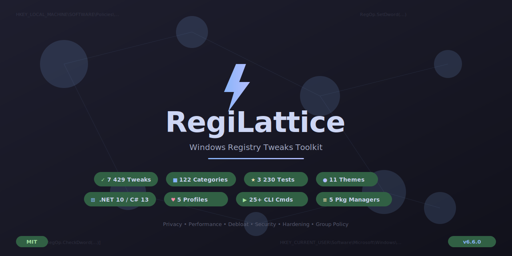
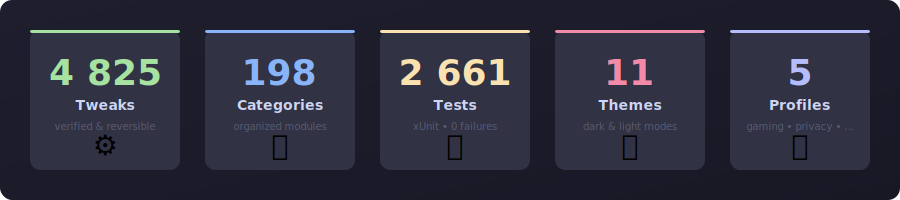
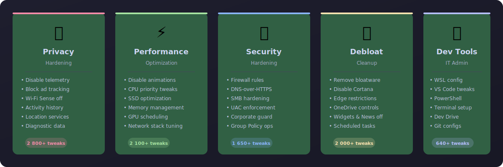
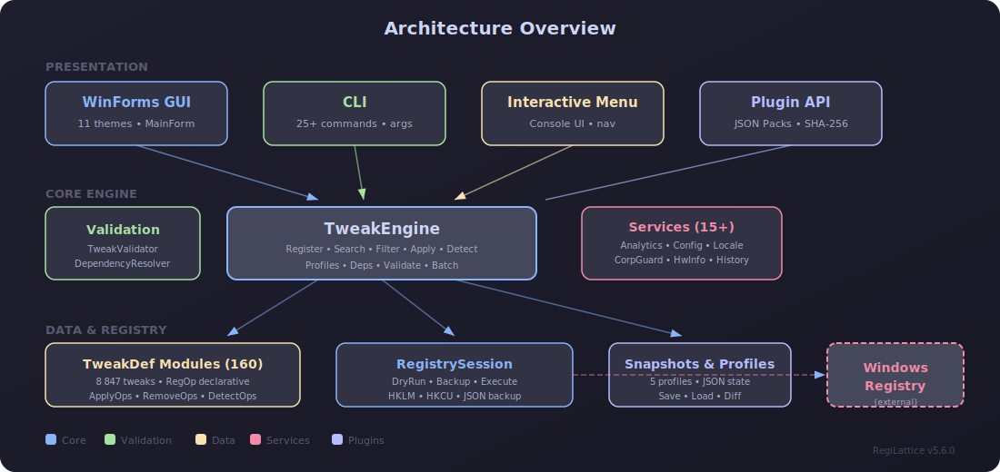
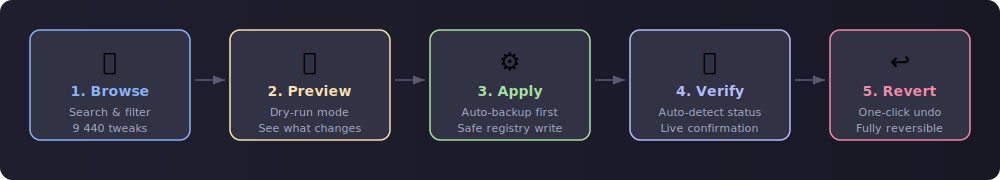
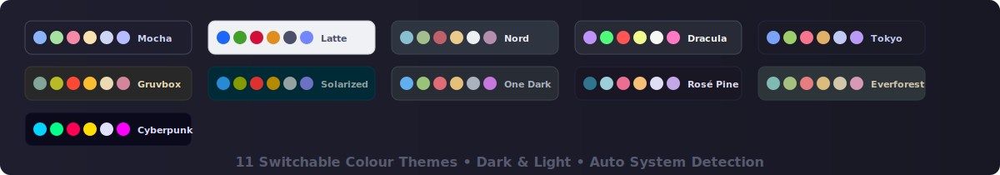

<!-- SEO / GitHub search keywords
     windows registry tweaks windows 11 debloat privacy hardening performance optimizer
     disable telemetry windows optimizer system hardening group policy alternative
     registry editor winforms gui cli dotnet csharp tweak engine
     shutup10 alternative w10privacy alternative O&O ShutUp10 winutil win11debloat
     windows 11 tweaks windows 10 tweaks gaming optimization security hardening
     registry backup corporate IT sysadmin gpo intune-compatible compliance audit
     7718 tweaks across 158 categories declarative regop engine dry-run snapshot diff
     RegiLattice windows-optimizer tweak-manager registry-automation open-source
-->

# ⚡ RegiLattice

<p align="center">
  
</p>

> **Windows 10 / Windows 11 registry tweaks toolkit** — privacy hardening · performance optimizer · debloater · security hardening · group policy alternative · .NET 10 C# · WinForms GUI · CLI

[](https://github.com/RajwanYair/RegiLattice/actions/workflows/ci.yml)


A comprehensive **Windows 10 / Windows 11 registry tweak toolkit** and system optimizer — debloater · privacy hardening tool · performance optimizer · security hardening · group policy alternative — with **7,718 verified tweaks** across **158 categories**, a **declarative RegOp engine**, a **full CLI** with 25+ commands, an **interactive console menu**, and a **WinForms GUI** with **11 switchable themes**. Built on **.NET 10 (C# 13)** for native performance on Windows 10/11 x64.

## Download & Install

**Pre-built installer (recommended):**

👉 **[Download RegiLattice v6.35.0](https://github.com/RajwanYair/RegiLattice/releases/latest)** (MSI installer + portable EXE) from the [Releases page](https://github.com/RajwanYair/RegiLattice/releases)

The MSI installer:
- Installs **GUI** (`RegiLattice.GUI.exe`) under `Program Files\RegiLattice\GUI\`
- Installs **CLI** (`RegiLattice.exe`) under `Program Files\RegiLattice\CLI\` and adds it to `PATH`
- Creates a **Start Menu** shortcut
- Supports **upgrade** and **uninstall** via Add/Remove Programs
- Requires no separate .NET runtime (self-contained, win-x64)

**Portable executables (no install required):**

Download `RegiLattice.GUI.exe` or `RegiLattice.exe` directly from the [Releases page](https://github.com/RajwanYair/RegiLattice/releases), place them anywhere, and run.

## Highlights

<p align="center">
  
</p>

- **7,718 verified tweaks** across 158 categories — each fully reversible with apply + remove
- **Declarative RegOp pattern** — most tweaks defined as data (`ApplyOps`/`RemoveOps`/`DetectOps`), not code
- **3 interfaces** — WinForms GUI, CLI with 25+ commands, interactive console menu
- **WinForms GUI** — 11 switchable themes (Catppuccin Mocha/Latte, Nord, Dracula, Tokyo Night, Gruvbox Dark, Solarized Dark, One Dark Pro, Rosé Pine, Everforest, Cyberpunk), collapsible categories, scope badges (USER/MACHINE/BOTH), live search, checkbox selection, status filters, profile selector
- **5 machine profiles** — business, gaming, privacy, minimal, server
- **Dry-run mode** — preview changes without touching the registry (`--dry-run`)
- **Snapshot & diff** — save/restore tweak state (JSON), compare snapshots (`--snapshot-diff`)
- **Compliance history** — rolling drift log; `--compliance-history` + `--compliance-report auto` CLI flags
- **Validation & stats** — `--validate` checks all TweakDef integrity; `--stats` shows scope/admin/corp breakdown
- **JSON export** — `--export-json` for scripting; `--export-reg` for .REG file generation
- **Composable filters** — `Filter()` engine API supports scope, category, min-build, tags, corp-safe, and free-text query
- **Dependency resolver** — topological ordering; `ApplyBatch()` auto-resolves deps
- **Parallel detection** — `StatusMap(parallel: true)` for fast batch status checks
- **UAC elevation** — automatic admin re-launch
- **Corporate network safety** — blocks tweaks on domain-joined, Azure AD, VPN, and managed machines
- **Automatic backups** — every registry mutation is backed up to JSON before changes
- **Package managers** — built-in Scoop, pip, Chocolatey, WinGet, and PowerShell module manager dialogs
- **3,373 tests** across 17+ test files — full engine, model, service, plugin, and GUI coverage (xUnit)
- **Dependency resolution** — `ResolveDependencies()` topological sort; `Dependents()` reverse lookup
- **Validation engine** — `ValidateTweaks()` checks IDs, labels, categories, broken DependsOn, circular deps
- **Plugin system** — JSON Tweak Packs with marketplace, SHA-256 verification
- **Localization** — built-in English + German locale (48 strings)

<p align="center">
  
</p>

## Architecture

> Full architecture reference — Mermaid diagrams for data flow, class model, CI pipeline, and more: **[docs/Architecture.md](docs/Architecture.md)**
> CLI commands reference: **[docs/CLI-Reference.md](docs/CLI-Reference.md)**
> Tweak categories reference: **[docs/TweakCategories.md](docs/TweakCategories.md)**

<p align="center">
  
</p>

## How It Works

<p align="center">
  
</p>

## Use Cases

| Who | What RegiLattice solves |
|-----|------------------------|
| **Privacy-conscious users** | Disable telemetry, activity tracking, Cortana, OneDrive sync, diagnostic data, and advertising IDs across 31 privacy categories in one pass |
| **Gamers** | Reduce input lag, disable background services, optimize GPU scheduling, power plan, TCP stack, and HPET across 31 gaming categories |
| **IT admins / sysadmins** | Batch-apply GPO-equivalent registry hardening (SEHOP, LSA-PPL, ASLR, SMB signing, UAC, BitLocker) with full rollback and dry-run mode |
| **Corporate IT / MDM** | CorporateGuard blocks unsafe tweaks on domain-joined, Azure AD, and Intune-managed machines; `--force` override when authorized |
| **Developers** | Declarative `TweakDef` + `RegOp` API, extensible plugin system, xUnit-tested, CLI for scripting and CI pipelines |
| **Power users** | Apply a machine profile (business/gaming/privacy/minimal/server) in a single command; snapshot before/after, diff, restore |

## Theme Gallery

<p align="center">
  
</p>

## Tweak Categories (153)

158 categories spanning privacy, performance, security, accessibility, gaming, networking, browser hardening, developer tools, cloud storage, remote desktop, virtualization, and more. Each tweak is fully reversible with apply/remove/detect operations.

See [docs/TweakCategories.md](docs/TweakCategories.md) for the full category reference, or use `--categories` for live counts.

## Requirements

- **Windows 10/11** (build 19041+)
- **.NET 10 Runtime** (or build from source with .NET 10 SDK)
- Administrator privileges for HKLM tweaks (auto-elevates via UAC prompt)

## Quick Start

### Build from Source

```powershell
# Clone and build
git clone https://github.com/RajwanYair/RegiLattice.git
cd RegiLattice
dotnet build RegiLattice.sln -c Release

# Run tests (3,373 tests)
dotnet test RegiLattice.sln

# Publish self-contained executables
dotnet publish src/RegiLattice.GUI/RegiLattice.GUI.csproj -c Release -r win-x64 --self-contained true -p:PublishSingleFile=true -o publish/gui
dotnet publish src/RegiLattice.CLI/RegiLattice.CLI.csproj -c Release -r win-x64 --self-contained true -p:PublishSingleFile=true -o publish/cli
```

### GUI (Recommended)

```powershell
dotnet run --project src/RegiLattice.GUI
# or run the published self-contained executable:
.\publish\gui\RegiLattice.GUI.exe
# or install via MSI and launch from Start Menu
```

WinForms window with **11 themes** (Catppuccin Mocha default), collapsible categories, scope badges (USER/MACHINE/BOTH), live search bar, checkbox selection (double-click to toggle), status filters, profile selector, and package manager dialogs (Scoop, pip, Chocolatey, WinGet).

### CLI

```powershell
dotnet run --project src/RegiLattice.CLI -- --list
dotnet run --project src/RegiLattice.CLI -- apply disable-telemetry
dotnet run --project src/RegiLattice.CLI -- remove disable-telemetry
dotnet run --project src/RegiLattice.CLI -- status disable-telemetry
dotnet run --project src/RegiLattice.CLI -- --profile gaming
dotnet run --project src/RegiLattice.CLI -- --gui
dotnet run --project src/RegiLattice.CLI -- --menu
dotnet run --project src/RegiLattice.CLI -- --dry-run --list
dotnet run --project src/RegiLattice.CLI -- --snapshot state.json
dotnet run --project src/RegiLattice.CLI -- --restore state.json
dotnet run --project src/RegiLattice.CLI -- --snapshot-diff before.json after.json
dotnet run --project src/RegiLattice.CLI -- --export-json tweaks.json
dotnet run --project src/RegiLattice.CLI -- --export-reg tweaks.reg
dotnet run --project src/RegiLattice.CLI -- --doctor
dotnet run --project src/RegiLattice.CLI -- --hwinfo
```

### Machine Profiles

```powershell
dotnet run --project src/RegiLattice.CLI -- --profile business   # 39 categories — productivity & security
dotnet run --project src/RegiLattice.CLI -- --profile gaming     # 31 categories — GPU & low-latency
dotnet run --project src/RegiLattice.CLI -- --profile privacy    # 31 categories — telemetry & tracking off
dotnet run --project src/RegiLattice.CLI -- --profile minimal    # 22 categories — fast, clean essentials
dotnet run --project src/RegiLattice.CLI -- --profile server     # 28 categories — hardened & headless
```

### PowerShell Launcher

```powershell
.\Launch-RegiLattice.ps1              # launch with defaults
.\Launch-RegiLattice.ps1 --gui        # launch GUI directly
```

## Corporate Network Safety

Automatically detects corporate environments (AD domain, Azure AD, VPN, GPO, SCCM/Intune) and **blocks non-safe tweaks** to prevent policy violations. Override with `--force` (CLI) or the "Force" checkbox (GUI) at your own risk.

## Adding a Custom Tweak

See [CONTRIBUTING.md](docs/CONTRIBUTING.md) for the full guide. Quick example:

```csharp
// src/RegiLattice.Core/Tweaks/MyCategory.cs
[TweakModule]
internal static class MyCategory
{
    private const string Key = @"HKEY_CURRENT_USER\Software\MyApp";
    internal static IReadOnlyList<TweakDef> Tweaks { get; } =
    [
        new TweakDef
        {
            Id = "myapp-fancy-mode",
            Label = "Enable Fancy Mode",
            Category = "My App",
            ImpactScore = 2,
            SafetyRating = 5,
            ApplyOps = [RegOp.SetDword(Key, "FancyMode", 1)],
            RemoveOps = [RegOp.DeleteValue(Key, "FancyMode")],
            DetectOps = [RegOp.CheckDword(Key, "FancyMode", 1)],
        },
    ];
}
```

---

## License

MIT — see [LICENSE](LICENSE) for details. RegiLattice is an independent open-source project, not affiliated with Microsoft Corporation.
