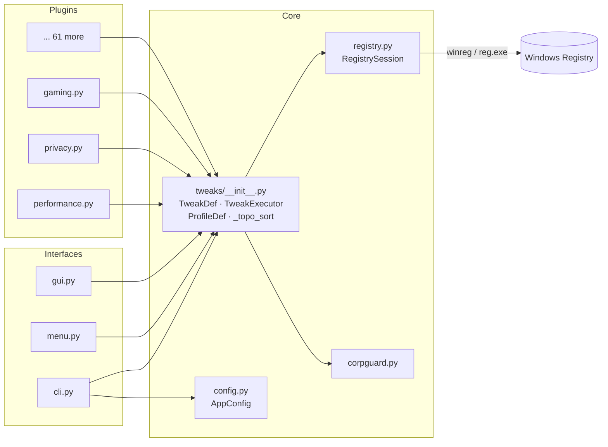

# ⚡ RegiLattice

[](https://github.com/RajwanYair/RegiLattice/actions/workflows/ci.yml)


A comprehensive Windows registry tweak toolkit with **1 292 tweaks** across **69 categories**, a **zero-wiring plugin architecture**, a **Python CLI**, **interactive console menu**, and a **tkinter GUI** (Catppuccin Mocha dark theme). Designed for power users who want fine-grained control over Windows 10/11 performance, privacy, usability, and application behaviour.

## Highlights

- **1 292 tweaks** across 69 categories — each fully reversible with apply + remove
- **Plugin architecture** — auto-discovers tweaks from `regilattice/tweaks/`, no registration needed
- **3 interfaces** — interactive console menu, CLI with flags, and tkinter GUI
- **GUI** — 4 switchable themes (Catppuccin Mocha/Latte, Nord, Dracula), menu bar (File/Edit/View/Help), zebra-striped rows, collapsible categories, scope badges (USER/MACHINE/BOTH), recommendation badges, rich hover tooltips, live search with status/scope filters
- **5 machine profiles** — business, gaming, privacy, minimal, server
- **Dry-run mode** — preview changes without touching the registry (`--dry-run`)
- **Snapshot & diff** — save/restore tweak state (JSON), compare snapshots (`--snapshot-diff`)
- **Validation & stats** — `--validate` checks all TweakDef integrity; `--stats` shows scope/admin/corp breakdown
- **JSON output** — `--list`, `--search`, and `--categories` support `--output json` for scripting
- **Composable filters** — `filter_tweaks()` engine API supports scope, category, min-build, tags, and free-text query
- **Dependency resolver** — `tweak_dependencies()` returns transitive dep chain in topological order; `apply_tweaks()` auto-resolves deps
- **Dependency graph** — tweaks can declare `depends_on` ordering; batch ops respect topological order
- **Config file** — persistent defaults via `~/.regilattice.toml` (`--config`)
- **Concurrent batch operations** — `ThreadPoolExecutor`-powered parallel apply/remove/detect
- **UAC elevation** — automatic admin re-launch via `ctypes.ShellExecuteW`
- **Corporate network safety** — blocks tweaks on domain-joined, Azure AD, VPN, and managed machines
- **Automatic backups** — every registry mutation is backed up before changes with rollback on error
- **Export PowerShell** — generate `.ps1` scripts from selected tweaks for portable deployment
- **~17 511 tests** across 21 test files — full smoke, CLI, GUI, and engine coverage

## Architecture



## Tweak Categories (69)

| Category                    |  #  | Category                    |  #  |
|-----------------------------|-----|-----------------------------|-----|
| Accessibility               |  20 | Network                     |  22 |
| Adobe                       |  20 | Night Light & Display       |  12 |
| AI / Copilot                |  22 | Notifications               |  16 |
| Audio                       |  19 | Office                      |  20 |
| Backup & Recovery           |  15 | OneDrive                    |  18 |
| Bluetooth                   |  19 | Package Management          |  21 |
| Boot                        |  21 | Performance                 |  20 |
| Chrome                      |  20 | Phone Link                  |  14 |
| Clipboard & Drag-Drop       |  15 | Power                       |  21 |
| Cloud Storage               |  30 | Printing                    |  15 |
| Communication               |  21 | Privacy                     |  25 |
| Context Menu                |  15 | RealVNC                     |  15 |
| Cortana & Search            |  22 | Remote Desktop              |  16 |
| Crash & Diagnostics         |  16 | Scheduled Tasks             |  16 |
| Dev Drive                   |  12 | Scoop Tools                 |  25 |
| Developer Tools             |  17 | Screensaver & Lock          |  16 |
| Display                     |  19 | Security                    |  21 |
| DNS & Networking Advanced   |  16 | Services                    |  21 |
| Edge                        |  18 | Shell                       |  20 |
| Explorer                    |  41 | Snap & Multitasking         |  17 |
| File System                 |  17 | Startup                     |  19 |
| Firefox                     |  20 | Storage                     |  19 |
| Fonts                       |  19 | System                      |  24 |
| Gaming                      |  19 | Taskbar                     |  19 |
| GPU / Graphics              |  19 | Telemetry Advanced          |  16 |
| Indexing & Search           |  16 | Touch & Pen                 |  13 |
| Input                       |  18 | USB & Peripherals           |  16 |
| Java                        |  16 | Virtualization              |  15 |
| LibreOffice                 |  18 | Voice Access & Speech       |  13 |
| Lock Screen & Login         |  16 | VS Code                     |  19 |
| M365 Copilot                |  18 | Widgets & News              |  15 |
| Maintenance                 |  17 | Windows 11                  |  29 |
| Microsoft Store             |  15 | Windows Terminal             |  16 |
| Multimedia                  |  15 | Windows Update              |  18 |
|                             |     | WSL                         |  29 |

## Requirements

- **Windows 10/11** (tested on 22H2+)
- **Python 3.10+** (3.14 recommended)
- Administrator privileges for HKLM tweaks (auto-elevates via UAC prompt)

## Quick Start

### GUI (Recommended)

```bash
python -m regilattice --gui
```

Tkinter window with 4 themes (Catppuccin Mocha default), menu bar, zebra-striped rows, per-category grouping, live search bar, scope badges (USER/MACHINE/BOTH), recommendation badges, per-row toggle buttons, and batch operations.

### Console Menu

```bash
python -m regilattice
```

Two-level interactive menu: browse categories, then select tweaks within each category.

### CLI

```bash
python -m regilattice apply disable-telemetry -y
python -m regilattice remove all --assume-yes
python -m regilattice --list
python -m regilattice --dry-run apply all
python -m regilattice --snapshot state.json
python -m regilattice --restore state.json
python -m regilattice --snapshot-diff before.json after.json
python -m regilattice --list-profiles
python -m regilattice --categories
python -m regilattice --tags
```

### Machine Profiles

```bash
python -m regilattice --profile business   # 39 categories — productivity, security, cloud & workflow
python -m regilattice --profile gaming     # 31 categories — GPU, performance, low-latency, distraction-free
python -m regilattice --profile privacy    # 31 categories — telemetry, tracking, cloud & browser data
python -m regilattice --profile minimal    # 22 categories — fast, clean system operation essentials
python -m regilattice --profile server     # 28 categories — hardened, headless, uptime & remote mgmt
```

### Windows Launcher

```text
Launch-RegiLattice.ps1              # auto-detects Python, passes CLI args
Launch-RegiLattice.ps1 --gui        # launch GUI directly
```

## Screenshots

> Place screenshot images in `docs/screenshots/` and reference them here.

| View | Description |
|------|-------------|
| **GUI — Catppuccin Mocha** | Main window with collapsible categories, scope badges (USER/MACHINE/BOTH), recommendation tags, and search bar |
| **GUI — Nord Theme** | Same layout with the Nord colour palette |
| **Tooltip Hover** | Rich tooltip showing description, current state, default/recommendation hints, tags, and registry keys |
| **Snapshot Diff (Terminal)** | Coloured terminal output comparing two snapshot files with added/removed/changed counts |
| **Snapshot Diff (HTML)** | HTML report with Catppuccin-themed table |
| **CLI — --list** | Terminal showing tweak list with categories, status badges, and descriptions |
| **Profile Selector** | GUI dropdown showing Business / Gaming / Privacy / Minimal / Server profiles |

## Corporate Network Safety

Automatically detects corporate environments and **blocks non-safe tweaks** to prevent policy violations:

- **Active Directory** domain membership (ctypes `GetComputerNameExW`)
- **Azure AD / Entra ID** join status (`dsregcmd /status`)
- **VPN adapters** — Cisco AnyConnect, GlobalProtect, Zscaler, WireGuard, etc.
- **Group Policy** registry indicators
- **SCCM / Intune** management agents

Override with `--force` (CLI) or the "Force" checkbox (GUI) at your own risk.

## Project Structure

```
RegiLattice/
├── pyproject.toml                   # Build config (hatchling)
├── Launch-RegiLattice.ps1           # PowerShell launcher
├── regilattice/                     # Python package
│   ├── __init__.py                  # Package version
│   ├── __main__.py                  # python -m regilattice -> cli.main()
│   ├── cli.py                       # argparse CLI entry point
│   ├── menu.py                      # Interactive console menu
│   ├── gui.py                       # tkinter GUI (Catppuccin Mocha, ~1 281 lines)
│   ├── gui_theme.py                 # Theme constants (colours, fonts)
│   ├── gui_tooltip.py               # Tooltip widget + description metadata parser
│   ├── gui_widgets.py               # TweakRow + CategorySection widgets
│   ├── gui_dialogs.py               # Import/export/about dialogs
│   ├── config.py                    # ~/.regilattice.toml support
│   ├── deps.py                      # Smart dependency management
│   ├── elevation.py                 # UAC elevation helpers
│   ├── registry.py                  # RegistrySession: winreg wrapper + backup + logging
│   ├── corpguard.py                 # Corporate network detection
│   └── tweaks/                      # Plugin-based tweak registry (64 modules)
│       ├── __init__.py              # TweakDef, TweakExecutor, ProfileDef, plugin loader
│       ├── _template.py             # Contributor guide -- copy to add a new tweak
│       ├── accessibility.py         # Accessibility (20 tweaks)
│       ├── ...                      # 62 more category modules, auto-discovered
│       └── wsl.py                   # WSL (29 tweaks)
├── tests/                           # pytest suites (~17 200 tests across 20 files)
│   ├── conftest.py                  # dry_session fixture, all_tweaks_list
│   ├── test_tweaks_smoke.py         # Auto-parametrized over all tweaks
│   ├── test_tweaks_init.py          # Plugin loader, profiles, batch ops
│   ├── test_cli.py                  # CLI argument parsing and commands
│   ├── test_config.py               # AppConfig loading
│   ├── test_corpguard.py            # Corporate network detection
│   ├── test_deps.py                 # lazy_import, install_package, require
│   ├── test_elevation.py            # UAC elevation helpers
│   ├── test_gui_dialogs.py          # PS1 export, JSON import, about dialog
│   ├── test_gui_theme.py            # Theme switching, colour validation
│   ├── test_gui_tooltip.py          # Tooltip text, metadata parsing
│   ├── test_gui_widgets.py          # Tweak scope classification
│   ├── test_menu.py                 # Interactive console menu
│   └── test_registry.py             # RegistrySession helpers and backup
├── .github/                         # CI, templates, architecture docs
└── .vscode/                         # Workspace settings
```

## Adding a Custom Tweak

Copy `regilattice/tweaks/_template.py` to a new file and follow the numbered steps inside.
See [CONTRIBUTING.md](CONTRIBUTING.md) for the full guide.

**Quick version:** create a `.py` file in `regilattice/tweaks/` exporting a `TWEAKS` list:

```python
from regilattice.registry import SESSION, assert_admin
from regilattice.tweaks import TweakDef

_KEY = r"HKEY_CURRENT_USER\Software\MyApp"

def _apply(*, require_admin: bool = True) -> None:
    assert_admin(require_admin)
    SESSION.backup([_KEY], "FancyMode")
    SESSION.set_dword(_KEY, "FancyMode", 1)

def _remove(*, require_admin: bool = True) -> None:
    assert_admin(require_admin)
    SESSION.delete_value(_KEY, "FancyMode")

def _detect() -> bool:
    return SESSION.read_dword(_KEY, "FancyMode") == 1

TWEAKS = [
    TweakDef(
        id="myapp-fancy-mode",
        label="Enable Fancy Mode",
        category="My App",
        apply_fn=_apply,
        remove_fn=_remove,
        detect_fn=_detect,
        needs_admin=False,
        registry_keys=[_KEY],
        description="Enables Fancy Mode in MyApp.",
        tags=["myapp", "fancy", "ui"],
    ),
]
```

The plugin loader discovers it automatically -- no registration code needed.

## License

MIT -- see [LICENSE](LICENSE) for details.
