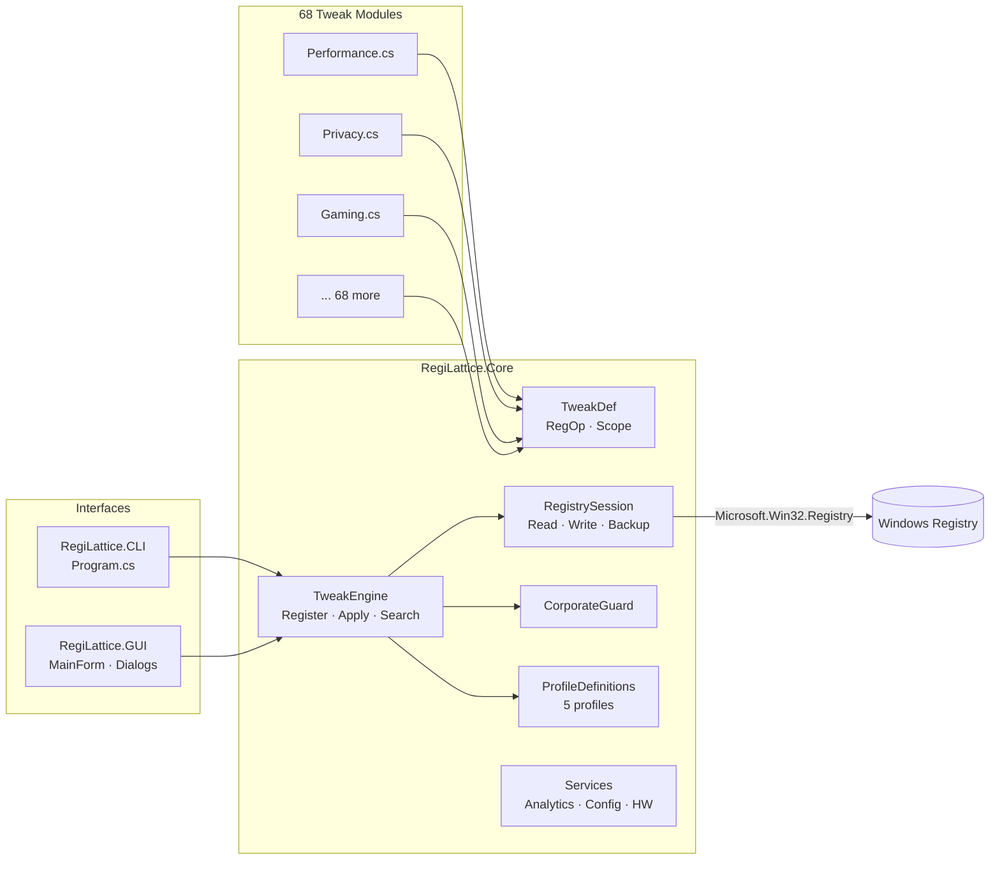

# ⚡ RegiLattice

[](https://github.com/RajwanYair/RegiLattice/actions/workflows/ci.yml)


A comprehensive Windows registry tweak toolkit with **1 360 verified tweaks** across **72 categories**, a **declarative RegOp engine**, a **full CLI**, **interactive console menu**, and a **WinForms GUI** with 4 switchable themes. Built on **.NET 10** for native performance on Windows 10/11.

## Highlights

- **1 360 verified tweaks** across 72 categories — each fully reversible with apply + remove
- **Declarative RegOp pattern** — most tweaks defined as data (`ApplyOps`/`RemoveOps`/`DetectOps`), not code
- **3 interfaces** — WinForms GUI, CLI with 25+ commands, interactive console menu
- **WinForms GUI** — 4 switchable themes (Catppuccin Mocha/Latte, Nord, Dracula), collapsible categories, scope badges (USER/MACHINE/BOTH), live search, status filters, profile selector
- **5 machine profiles** — business, gaming, privacy, minimal, server
- **Dry-run mode** — preview changes without touching the registry (`--dry-run`)
- **Snapshot & diff** — save/restore tweak state (JSON), compare snapshots (`--snapshot-diff`)
- **Validation & stats** — `--validate` checks all TweakDef integrity; `--stats` shows scope/admin/corp breakdown
- **JSON export** — `--export-json` for scripting; `--export-reg` for .REG file generation
- **Composable filters** — `Filter()` engine API supports scope, category, min-build, tags, corp-safe, and free-text query
- **Dependency resolver** — topological ordering; `ApplyBatch()` auto-resolves deps
- **Parallel detection** — `StatusMap(parallel: true)` for fast batch status checks
- **UAC elevation** — automatic admin re-launch
- **Corporate network safety** — blocks tweaks on domain-joined, Azure AD, VPN, and managed machines
- **Automatic backups** — every registry mutation is backed up to JSON before changes
- **Package managers** — built-in Scoop, pip, and PowerShell module manager dialogs
- **129 tests** across 6 test files — full engine, model, service, and GUI coverage (xUnit)

## Architecture



## Tweak Categories (69)

| Category                    |  #  | Category                    |  #  |
|-----------------------------|-----|-----------------------------|-----|
| Accessibility               |  20 | Network                     |  36 |
| Adobe                       |  20 | Night Light & Display       |  12 |
| AI / Copilot                |  22 | Notifications               |  21 |
| Audio                       |  24 | Office                      |  20 |
| Backup & Recovery           |  15 | OneDrive                    |  18 |
| Bluetooth                   |  19 | Package Management          |  21 |
| Boot                        |  26 | Performance                 |  30 |
| Chrome                      |  20 | Phone Link                  |  14 |
| Clipboard & Drag-Drop       |  15 | Power                       |  26 |
| Cloud Storage               |  30 | Printing                    |  20 |
| Communication               |  21 | Privacy                     |  33 |
| Context Menu                |  20 | RealVNC                     |  15 |
| Cortana & Search            |  22 | Remote Desktop              |  21 |
| Crash & Diagnostics         |  16 | Scheduled Tasks             |  21 |
| Dev Drive                   |  12 | Scoop Tools                 |  25 |
| Developer Tools             |  17 | Screensaver & Lock          |  16 |
| Display                     |  19 | Security                    |  34 |
| DNS & Networking Advanced   |  16 | Services                    |  21 |
| Edge                        |  18 | Shell                       |  20 |
| Explorer                    |  46 | Snap & Multitasking         |  17 |
| File System                 |  17 | Startup                     |  22 |
| Firefox                     |  20 | Storage                     |  19 |
| Fonts                       |  19 | System                      |  24 |
| Gaming                      |  24 | Taskbar                     |  24 |
| GPU / Graphics              |  19 | Telemetry Advanced          |  21 |
| Indexing & Search           |  21 | Touch & Pen                 |  13 |
| Input                       |  18 | USB & Peripherals           |  16 |
| Java                        |  16 | Virtualization              |  20 |
| LibreOffice                 |  18 | Voice Access & Speech       |  13 |
| Lock Screen & Login         |  16 | VS Code                     |  19 |
| M365 Copilot                |  18 | Widgets & News              |  20 |
| Maintenance                 |  17 | Windows 11                  |  35 |
| Microsoft Store             |  15 | Windows Terminal             |  16 |
| Multimedia                  |  15 | Windows Update              |  22 |
|                             |     | WSL                         |  35 |

## Requirements

- **Windows 10/11** (build 19041+)
- **.NET 10 Runtime** (or build from source with .NET 10 SDK)
- Administrator privileges for HKLM tweaks (auto-elevates via UAC prompt)

## Quick Start

### Build from Source

```powershell
# Clone and build
git clone https://github.com/RajwanYair/RegiLattice.git
cd RegiLattice
dotnet build RegiLattice.sln -c Release

# Run tests
dotnet test RegiLattice.sln
```

### GUI (Recommended)

```powershell
dotnet run --project src/RegiLattice.GUI
# or after publishing:
RegiLattice.GUI.exe
```

WinForms window with 4 themes (Catppuccin Mocha default), collapsible categories, scope badges (USER/MACHINE/BOTH), live search bar, status filters, profile selector, and package manager dialogs.

### CLI

```powershell
dotnet run --project src/RegiLattice.CLI -- --list
dotnet run --project src/RegiLattice.CLI -- apply disable-telemetry
dotnet run --project src/RegiLattice.CLI -- remove disable-telemetry
dotnet run --project src/RegiLattice.CLI -- status disable-telemetry
dotnet run --project src/RegiLattice.CLI -- --profile gaming
dotnet run --project src/RegiLattice.CLI -- --gui
dotnet run --project src/RegiLattice.CLI -- --menu
dotnet run --project src/RegiLattice.CLI -- --dry-run --list
dotnet run --project src/RegiLattice.CLI -- --snapshot state.json
dotnet run --project src/RegiLattice.CLI -- --restore state.json
dotnet run --project src/RegiLattice.CLI -- --snapshot-diff before.json after.json
dotnet run --project src/RegiLattice.CLI -- --export-json tweaks.json
dotnet run --project src/RegiLattice.CLI -- --export-reg tweaks.reg
dotnet run --project src/RegiLattice.CLI -- --doctor
dotnet run --project src/RegiLattice.CLI -- --hwinfo
```

### Machine Profiles

```powershell
dotnet run --project src/RegiLattice.CLI -- --profile business   # 39 categories — productivity & security
dotnet run --project src/RegiLattice.CLI -- --profile gaming     # 31 categories — GPU & low-latency
dotnet run --project src/RegiLattice.CLI -- --profile privacy    # 31 categories — telemetry & tracking off
dotnet run --project src/RegiLattice.CLI -- --profile minimal    # 22 categories — fast, clean essentials
dotnet run --project src/RegiLattice.CLI -- --profile server     # 28 categories — hardened & headless
```

### PowerShell Launcher

```powershell
.\Launch-RegiLattice.ps1              # launch with defaults
.\Launch-RegiLattice.ps1 --gui        # launch GUI directly
```

## Screenshots

> Place screenshot images in `docs/screenshots/` and reference them here.

| View | Description |
|------|-------------|
| **GUI — Catppuccin Mocha** | Main window with collapsible categories, scope badges, and search bar |
| **GUI — Nord Theme** | Same layout with the Nord colour palette |
| **CLI — --list** | Terminal output with categories, status badges, and descriptions |
| **Snapshot Diff** | Coloured terminal or HTML diff comparing two snapshot files |
| **Profile Selector** | GUI dropdown showing Business / Gaming / Privacy / Minimal / Server profiles |
| **About Dialog** | System info, hardware detection, and version details |

## Corporate Network Safety

Automatically detects corporate environments and **blocks non-safe tweaks** to prevent policy violations:

- **Active Directory** domain membership (P/Invoke `GetComputerNameExW`)
- **Azure AD / Entra ID** join status (`dsregcmd /status`)
- **VPN adapters** — Cisco AnyConnect, GlobalProtect, Zscaler, WireGuard, etc.
- **Group Policy** registry indicators
- **SCCM / Intune** management agents

Override with `--force` (CLI) or the "Force" checkbox (GUI) at your own risk.

## Project Structure

```
RegiLattice/
├── RegiLattice.sln                          # Visual Studio solution
├── Launch-RegiLattice.ps1                   # PowerShell launcher
├── src/
│   ├── RegiLattice.Core/                    # Core library (netstandard/net10.0)
│   │   ├── TweakEngine.cs                   # Central tweak manager
│   │   ├── Models/
│   │   │   ├── TweakDef.cs                  # Immutable tweak definition + RegOp
│   │   │   ├── ProfileDef.cs                # Profile definition model
│   │   │   └── ProfileDefinitions.cs        # 5 hardcoded profiles
│   │   ├── Registry/
│   │   │   └── RegistrySession.cs           # Registry read/write/backup wrapper
│   │   ├── Services/
│   │   │   ├── Analytics.cs                 # Local usage analytics
│   │   │   ├── AppConfig.cs                 # Configuration management
│   │   │   ├── CorporateGuard.cs            # Corporate network detection
│   │   │   ├── Elevation.cs                 # UAC elevation helpers
│   │   │   ├── HardwareInfo.cs              # Hardware detection + profile suggestion
│   │   │   ├── Locale.cs                    # i18n string table
│   │   │   └── Ratings.cs                   # Tweak rating system (1-5 stars)
│   │   └── Tweaks/                          # 71 category modules
│   │       ├── Accessibility.cs             # Accessibility (20 tweaks)
│   │       ├── Performance.cs               # Performance (30 tweaks)
│   │       ├── Privacy.cs                   # Privacy (33 tweaks)
│   │       ├── ...                          # 68 more category modules
│   │       └── Wsl.cs                       # WSL (35 tweaks)
│   ├── RegiLattice.GUI/                     # WinForms GUI (net10.0-windows)
│   │   ├── Program.cs                       # Entry point
│   │   ├── Theme.cs                         # 4-theme engine
│   │   └── Forms/
│   │       ├── MainForm.cs                  # Main window
│   │       ├── AboutDialog.cs               # About + hardware info
│   │       ├── ScoopManagerDialog.cs        # Scoop package manager
│   │       └── PSModuleManagerDialog.cs     # PowerShell module manager
│   └── RegiLattice.CLI/                     # Console CLI (net10.0)
│       └── Program.cs                       # 25+ commands
├── tests/
│   ├── RegiLattice.Core.Tests/              # xUnit tests (93 tests)
│   │   ├── TweakDefTests.cs
│   │   ├── TweakEngineTests.cs
│   │   ├── RegistrySessionTests.cs
│   │   └── ServicesTests.cs
│   └── RegiLattice.GUI.Tests/              # xUnit tests (36 tests)
│       ├── ThemeTests.cs
│       └── PackageManagerValidationTests.cs
├── winget/                                  # Winget package manifests
├── docs/                                    # Documentation
└── .vscode/                                 # VS Code workspace settings
```

## Adding a Custom Tweak

Create a new `.cs` file in `src/RegiLattice.Core/Tweaks/` and register it in `TweakEngine.RegisterBuiltins()`.

**Example — declarative RegOp pattern** (preferred for simple registry tweaks):

```csharp
// src/RegiLattice.Core/Tweaks/MyCategory.cs
using RegiLattice.Core.Models;

namespace RegiLattice.Core.Tweaks;

public static class MyCategory
{
    private const string Key = @"HKEY_CURRENT_USER\Software\MyApp";

    public static List<TweakDef> Tweaks { get; } =
    [
        new TweakDef
        {
            Id = "myapp-fancy-mode",
            Label = "Enable Fancy Mode",
            Category = "My App",
            NeedsAdmin = false,
            CorpSafe = true,
            RegistryKeys = [Key],
            Description = "Enables Fancy Mode in MyApp.",
            Tags = ["myapp", "fancy", "ui"],
            ApplyOps = [RegOp.SetDword(Key, "FancyMode", 1)],
            RemoveOps = [RegOp.DeleteValue(Key, "FancyMode")],
            DetectOps = [RegOp.CheckDword(Key, "FancyMode", 1)],
        },
    ];
}
```

For complex tweaks that need custom logic, use `ApplyAction`/`RemoveAction`/`DetectAction` delegates instead:

```csharp
new TweakDef
{
    Id = "myapp-complex-tweak",
    Label = "Complex Custom Logic",
    Category = "My App",
    RegistryKeys = [Key],
    ApplyAction = (requireAdmin) => { /* custom apply logic */ },
    RemoveAction = (requireAdmin) => { /* custom remove logic */ },
    DetectAction = () => { /* return true if applied */ return false; },
}
```

See [CONTRIBUTING.md](CONTRIBUTING.md) for the full guide.

## License

MIT — see [LICENSE](LICENSE) for details.
