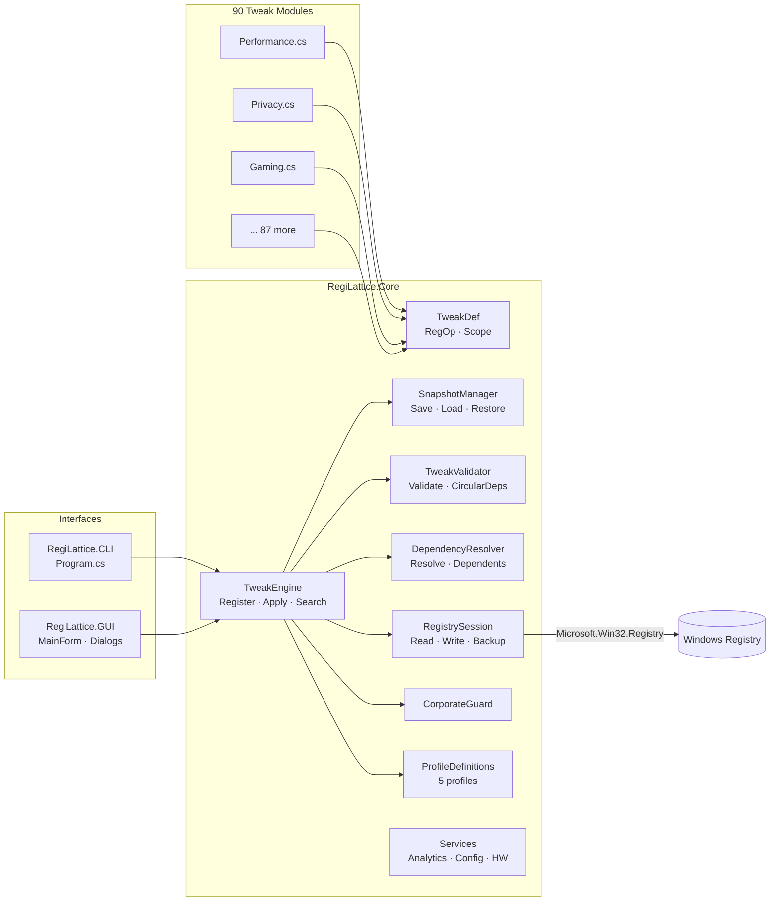

# ⚡ RegiLattice

[](https://github.com/RajwanYair/RegiLattice/actions/workflows/ci.yml)


A comprehensive Windows registry tweak toolkit with **3 183 verified tweaks** across **92 categories**, a **declarative RegOp engine**, a **full CLI** with 25+ commands, an **interactive console menu**, and a **WinForms GUI** with **11 switchable themes**. Built on **.NET 10** for native performance on Windows 10/11.

## Download & Install

**Pre-built installer (recommended):**

👉 **[Download RegiLattice-3.7.1-win-x64.msi](https://github.com/RajwanYair/RegiLattice/releases/latest)** from the [Releases page](https://github.com/RajwanYair/RegiLattice/releases)

The MSI installer:
- Installs **GUI** (`RegiLattice.GUI.exe`) under `Program Files\RegiLattice\GUI\`
- Installs **CLI** (`RegiLattice.exe`) under `Program Files\RegiLattice\CLI\` and adds it to `PATH`
- Creates a **Start Menu** shortcut
- Supports **upgrade** and **uninstall** via Add/Remove Programs
- Requires no separate .NET runtime (self-contained, win-x64)

**Portable executables (no install required):**

Download `RegiLattice.GUI.exe` or `RegiLattice.exe` directly from the [Releases page](https://github.com/RajwanYair/RegiLattice/releases), place them anywhere, and run.

## Highlights

- **3 183 verified tweaks** across 92 categories — each fully reversible with apply + remove
- **Declarative RegOp pattern** — most tweaks defined as data (`ApplyOps`/`RemoveOps`/`DetectOps`), not code
- **3 interfaces** — WinForms GUI, CLI with 25+ commands, interactive console menu
- **WinForms GUI** — 11 switchable themes (Catppuccin Mocha/Latte, Nord, Dracula, Tokyo Night, Gruvbox Dark, Solarized Dark, One Dark Pro, Rosé Pine, Everforest, Cyberpunk), collapsible categories, scope badges (USER/MACHINE/BOTH), live search, checkbox selection, status filters, profile selector
- **5 machine profiles** — business, gaming, privacy, minimal, server
- **Dry-run mode** — preview changes without touching the registry (`--dry-run`)
- **Snapshot & diff** — save/restore tweak state (JSON), compare snapshots (`--snapshot-diff`)
- **Validation & stats** — `--validate` checks all TweakDef integrity; `--stats` shows scope/admin/corp breakdown
- **JSON export** — `--export-json` for scripting; `--export-reg` for .REG file generation
- **Composable filters** — `Filter()` engine API supports scope, category, min-build, tags, corp-safe, and free-text query
- **Dependency resolver** — topological ordering; `ApplyBatch()` auto-resolves deps
- **Parallel detection** — `StatusMap(parallel: true)` for fast batch status checks
- **UAC elevation** — automatic admin re-launch
- **Corporate network safety** — blocks tweaks on domain-joined, Azure AD, VPN, and managed machines
- **Automatic backups** — every registry mutation is backed up to JSON before changes
- **Package managers** — built-in Scoop, pip, Chocolatey, WinGet, and PowerShell module manager dialogs
- **1 879 tests** across 17 test files — full engine, model, service, plugin, and GUI coverage (xUnit)
- **Dependency resolution** — `ResolveDependencies()` topological sort; `Dependents()` reverse lookup
- **Validation engine** — `ValidateTweaks()` checks IDs, labels, categories, broken DependsOn, circular deps
- **Plugin system** — JSON Tweak Packs with marketplace, SHA-256 verification
- **Localization** — built-in English + German locale (48 strings)

## Architecture



## Tweak Categories (89)

89 categories spanning privacy, performance, security, accessibility, gaming, networking, browser hardening, developer tools, and more. Each tweak is fully reversible with apply/remove/detect operations.

See `--show-categories` for the full list with tweak counts, or use `--stats` for a complete breakdown.

## Requirements

- **Windows 10/11** (build 19041+)
- **.NET 10 Runtime** (or build from source with .NET 10 SDK)
- Administrator privileges for HKLM tweaks (auto-elevates via UAC prompt)

## Quick Start

### Build from Source

```powershell
# Clone and build
git clone https://github.com/RajwanYair/RegiLattice.git
cd RegiLattice
dotnet build RegiLattice.sln -c Release

# Run tests (1 879 tests)
dotnet test RegiLattice.sln

# Publish self-contained executables
dotnet publish src/RegiLattice.GUI/RegiLattice.GUI.csproj -c Release -r win-x64 --self-contained true -p:PublishSingleFile=true -o publish/gui
dotnet publish src/RegiLattice.CLI/RegiLattice.CLI.csproj -c Release -r win-x64 --self-contained true -p:PublishSingleFile=true -o publish/cli
```

### GUI (Recommended)

```powershell
dotnet run --project src/RegiLattice.GUI
# or run the published self-contained executable:
.\publish\gui\RegiLattice.GUI.exe
# or install via MSI and launch from Start Menu
```

WinForms window with **11 themes** (Catppuccin Mocha default), collapsible categories, scope badges (USER/MACHINE/BOTH), live search bar, checkbox selection (double-click to toggle), status filters, profile selector, and package manager dialogs (Scoop, pip, Chocolatey, WinGet).

### CLI

```powershell
dotnet run --project src/RegiLattice.CLI -- --list
dotnet run --project src/RegiLattice.CLI -- apply disable-telemetry
dotnet run --project src/RegiLattice.CLI -- remove disable-telemetry
dotnet run --project src/RegiLattice.CLI -- status disable-telemetry
dotnet run --project src/RegiLattice.CLI -- --profile gaming
dotnet run --project src/RegiLattice.CLI -- --gui
dotnet run --project src/RegiLattice.CLI -- --menu
dotnet run --project src/RegiLattice.CLI -- --dry-run --list
dotnet run --project src/RegiLattice.CLI -- --snapshot state.json
dotnet run --project src/RegiLattice.CLI -- --restore state.json
dotnet run --project src/RegiLattice.CLI -- --snapshot-diff before.json after.json
dotnet run --project src/RegiLattice.CLI -- --export-json tweaks.json
dotnet run --project src/RegiLattice.CLI -- --export-reg tweaks.reg
dotnet run --project src/RegiLattice.CLI -- --doctor
dotnet run --project src/RegiLattice.CLI -- --hwinfo
```

### Machine Profiles

```powershell
dotnet run --project src/RegiLattice.CLI -- --profile business   # 39 categories — productivity & security
dotnet run --project src/RegiLattice.CLI -- --profile gaming     # 31 categories — GPU & low-latency
dotnet run --project src/RegiLattice.CLI -- --profile privacy    # 31 categories — telemetry & tracking off
dotnet run --project src/RegiLattice.CLI -- --profile minimal    # 22 categories — fast, clean essentials
dotnet run --project src/RegiLattice.CLI -- --profile server     # 28 categories — hardened & headless
```

### PowerShell Launcher

```powershell
.\Launch-RegiLattice.ps1              # launch with defaults
.\Launch-RegiLattice.ps1 --gui        # launch GUI directly
```

## Screenshots

> Place screenshot images in `docs/screenshots/` and reference them here.

| View | Description |
|------|-------------|
| **GUI — Catppuccin Mocha** | Main window with collapsible categories, scope badges, and search bar |
| **GUI — Nord Theme** | Same layout with the Nord colour palette |
| **CLI — --list** | Terminal output with categories, status badges, and descriptions |
| **Snapshot Diff** | Coloured terminal or HTML diff comparing two snapshot files |
| **Profile Selector** | GUI dropdown showing Business / Gaming / Privacy / Minimal / Server profiles |
| **About Dialog** | System info, hardware detection, and version details |

## Corporate Network Safety

Automatically detects corporate environments and **blocks non-safe tweaks** to prevent policy violations:

- **Active Directory** domain membership (P/Invoke `GetComputerNameExW`)
- **Azure AD / Entra ID** join status (`dsregcmd /status`)
- **VPN adapters** — Cisco AnyConnect, GlobalProtect, Zscaler, WireGuard, etc.
- **Group Policy** registry indicators
- **SCCM / Intune** management agents

Override with `--force` (CLI) or the "Force" checkbox (GUI) at your own risk.

## Project Structure

```
RegiLattice/
├── RegiLattice.sln                          # Visual Studio solution
├── Launch-RegiLattice.ps1                   # PowerShell launcher
├── src/
│   ├── RegiLattice.Core/                    # Core library (netstandard/net10.0)
│   │   ├── TweakEngine.cs                   # Central tweak manager
│   │   ├── SnapshotManager.cs               # Save/load/restore tweak state snapshots
│   │   ├── TweakValidator.cs                # Tweak integrity validation & circular dep detection
│   │   ├── DependencyResolver.cs            # Topological dependency resolution
│   │   ├── Models/
│   │   │   ├── TweakDef.cs                  # Immutable tweak definition + RegOp
│   │   │   ├── ProfileDef.cs                # Profile definition model
│   │   │   └── ProfileDefinitions.cs        # 5 hardcoded profiles
│   │   ├── Registry/
│   │   │   └── RegistrySession.cs           # Registry read/write/backup wrapper
│   │   ├── Services/
│   │   │   ├── Analytics.cs                 # Local usage analytics
│   │   │   ├── AppConfig.cs                 # Configuration management
│   │   │   ├── ChocolateyManager.cs         # Chocolatey package manager integration
│   │   │   ├── CorporateGuard.cs            # Corporate network detection
│   │   │   ├── Elevation.cs                 # UAC elevation helpers
│   │   │   ├── HardwareInfo.cs              # Hardware detection + profile suggestion
│   │   │   ├── Locale.cs                    # i18n string table
│   │   │   ├── PipManager.cs                # pip package manager integration
│   │   │   ├── Ratings.cs                   # Tweak rating system (1-5 stars)
│   │   │   ├── ShellRunner.cs               # Safe process execution wrapper
│   │   │   └── WinGetManager.cs             # WinGet package manager integration
│   │   ├── Plugins/                          # Tweak Pack system (JSON marketplace)
│   │   └── Tweaks/                          # 93 category modules, 3 183 tweaks
│   │       ├── Accessibility.cs
│   │       ├── Performance.cs
│   │       ├── Privacy.cs
│   │       ├── ...                          # 87 more
│   │       └── Wsl.cs
│   ├── RegiLattice.GUI/                     # WinForms GUI (net10.0-windows)
│   │   ├── Program.cs                       # Entry point
│   │   ├── AppIcons.cs                      # Programmatic icon/bitmap generation
│   │   ├── Theme.cs                         # 11-theme engine
│   │   ├── Forms/
│   │   │   ├── MainForm.cs                  # Main window
│   │   │   ├── AboutDialog.cs               # About + hardware info
│   │   │   ├── ChocolateyManagerDialog.cs
│   │   │   ├── MarketplaceDialog.cs         # Tweak Pack marketplace browser
│   │   │   ├── PipManagerDialog.cs
│   │   │   ├── PSModuleManagerDialog.cs
│   │   │   ├── ScoopManagerDialog.cs
│   │   │   ├── ToolVersionsDialog.cs        # Installed tool version checker
│   │   │   ├── WindowsHealthDialog.cs       # System health & maintenance
│   │   │   └── WinGetManagerDialog.cs
│   │   └── PackageManagers/                 # GUI-side package manager wrappers
│   │       ├── PackageNameValidator.cs      # Shared name validation (regex)
│   │       ├── ShellRunner.cs               # Process execution for GUI dialogs
│   │       ├── ScoopManager.cs
│   │       ├── PipManager.cs
│   │       ├── PSModuleManager.cs
│   │       ├── ChocolateyManager.cs
│   │       ├── WinGetManager.cs
│   │       ├── ToolVersionChecker.cs
│   │       └── WindowsHealthManager.cs
│   └── RegiLattice.CLI/                     # Console CLI (net10.0)
│       ├── Program.cs                       # 25+ commands
│       ├── CliArgs.cs                       # CLI argument model
│       └── ConsoleColorizer.cs              # ANSI terminal colour helpers
├── tests/
│   ├── RegiLattice.Core.Tests/              # 1444 xUnit tests
│   │   ├── TweakDefTests.cs
│   │   ├── TweakEngineTests.cs
│   │   ├── TweakEngineBuiltinsTests.cs
│   │   ├── RegistrySessionTests.cs
│   │   ├── ServicesTests.cs
│   │   ├── PluginTests.cs
│   │   ├── SnapshotManagerTests.cs
│   │   ├── TweakValidatorTests.cs
│   │   ├── DependencyResolverTests.cs
│   │   ├── FavoritesTests.cs
│   │   ├── TweakHistoryTests.cs
│   │   └── ConfigExporterTests.cs
│   ├── RegiLattice.CLI.Tests/               # 154 xUnit tests
│   │   └── ParseArgsTests.cs
│   └── RegiLattice.GUI.Tests/               # 490 xUnit tests
│       ├── ThemeTests.cs
│       ├── PackageManagerValidationTests.cs
│       └── AppIconsTests.cs
├── winget/                                  # Winget package manifests
├── docs/                                    # Documentation
└── .vscode/                                 # VS Code workspace settings
```

## Adding a Custom Tweak

Create a new `.cs` file in `src/RegiLattice.Core/Tweaks/` and register it in `TweakEngine.RegisterBuiltins()`.

**Example — declarative RegOp pattern** (preferred for simple registry tweaks):

```csharp
// src/RegiLattice.Core/Tweaks/MyCategory.cs
using RegiLattice.Core.Models;

namespace RegiLattice.Core.Tweaks;

public static class MyCategory
{
    private const string Key = @"HKEY_CURRENT_USER\Software\MyApp";

    public static List<TweakDef> Tweaks { get; } =
    [
        new TweakDef
        {
            Id = "myapp-fancy-mode",
            Label = "Enable Fancy Mode",
            Category = "My App",
            NeedsAdmin = false,
            CorpSafe = true,
            RegistryKeys = [Key],
            Description = "Enables Fancy Mode in MyApp.",
            Tags = ["myapp", "fancy", "ui"],
            ApplyOps = [RegOp.SetDword(Key, "FancyMode", 1)],
            RemoveOps = [RegOp.DeleteValue(Key, "FancyMode")],
            DetectOps = [RegOp.CheckDword(Key, "FancyMode", 1)],
        },
    ];
}
```

For complex tweaks that need custom logic, use `ApplyAction`/`RemoveAction`/`DetectAction` delegates instead:

```csharp
new TweakDef
{
    Id = "myapp-complex-tweak",
    Label = "Complex Custom Logic",
    Category = "My App",
    RegistryKeys = [Key],
    ApplyAction = (requireAdmin) => { /* custom apply logic */ },
    RemoveAction = (requireAdmin) => { /* custom remove logic */ },
    DetectAction = () => { /* return true if applied */ return false; },
}
```

See [CONTRIBUTING.md](docs/CONTRIBUTING.md) for the full guide.

## Building the Installer

The MSI installer is built with [WiX Toolset v6](https://wixtoolset.org/). It requires the self-contained publish outputs to exist first:

```powershell
# 1. Publish self-contained executables
dotnet publish src/RegiLattice.GUI/RegiLattice.GUI.csproj -c Release -r win-x64 --self-contained true -p:PublishSingleFile=true -o publish/gui
dotnet publish src/RegiLattice.CLI/RegiLattice.CLI.csproj -c Release -r win-x64 --self-contained true -p:PublishSingleFile=true -o publish/cli

# 2. Build the MSI
dotnet build installer/RegiLattice.Installer.wixproj -c Release

# Output: installer/bin/Release/RegiLattice.msi
```

Install WiX toolset (if not already installed):

```powershell
dotnet tool install --global wix
# or update:
dotnet tool update --global wix
```

## License

MIT — see [LICENSE](LICENSE) for details.

---

## Keywords

`windows-registry` · `windows-tweaks` · `windows-11` · `windows-10` · `registry-optimizer` ·
`privacy-tweaks` · `performance-tweaks` · `system-optimization` · `debloat` · `winforms` ·
`dotnet` · `csharp` · `registry-backup` · `windows-hardening` · `gaming-optimization` ·
`corporate-safety` · `package-manager` · `tweak-toolkit` · `registry-editor` · `win11-tweaks`
