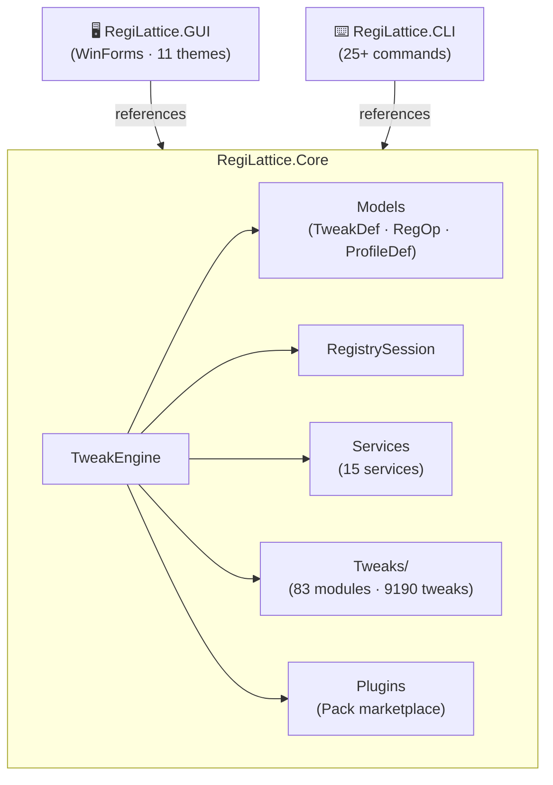
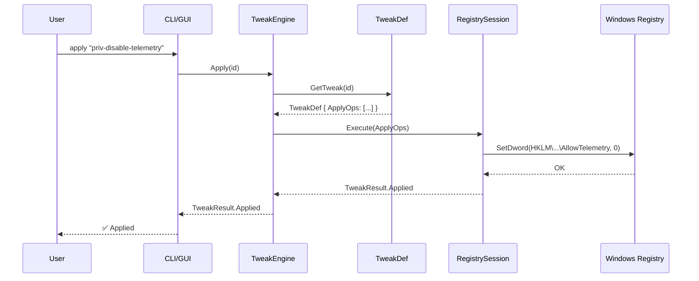
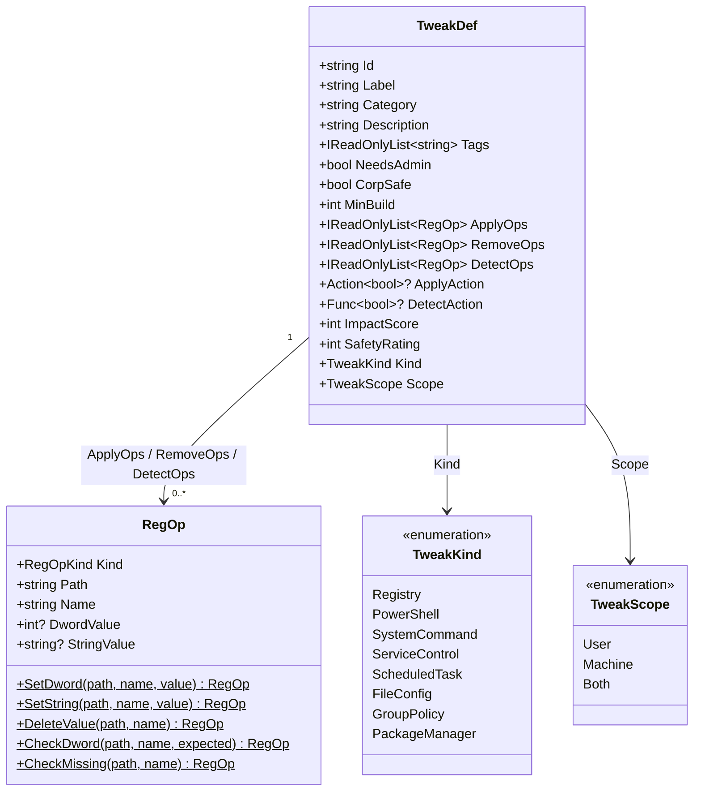
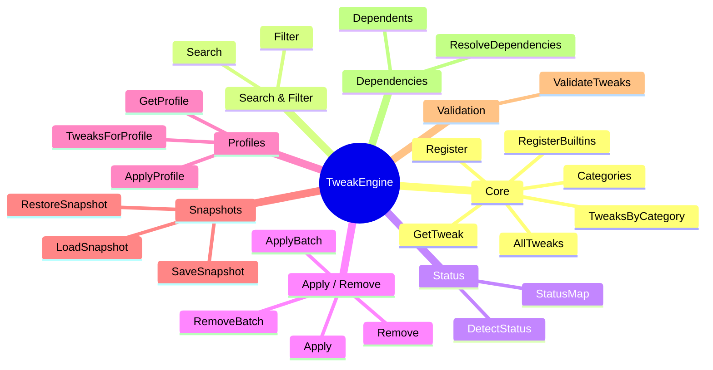
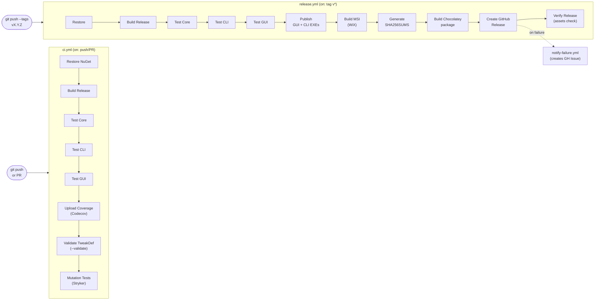
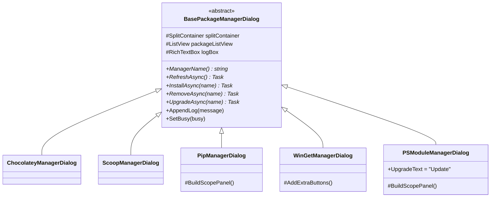
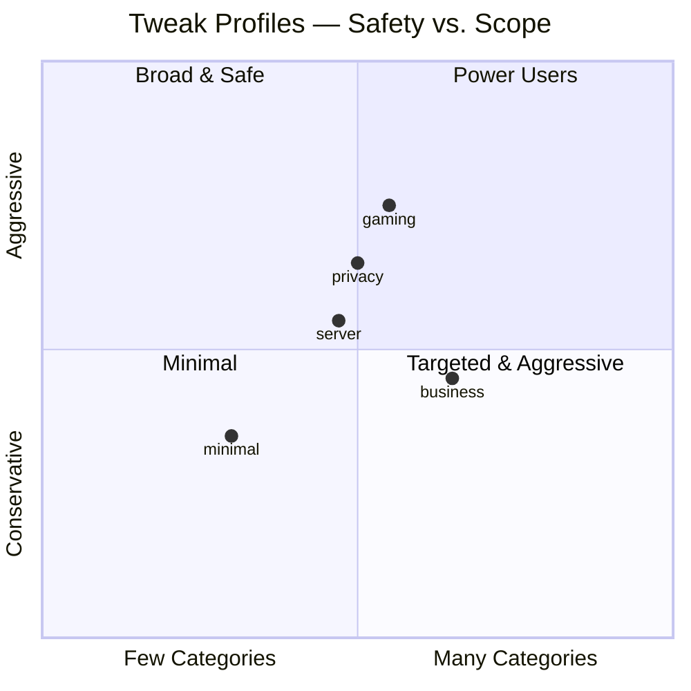
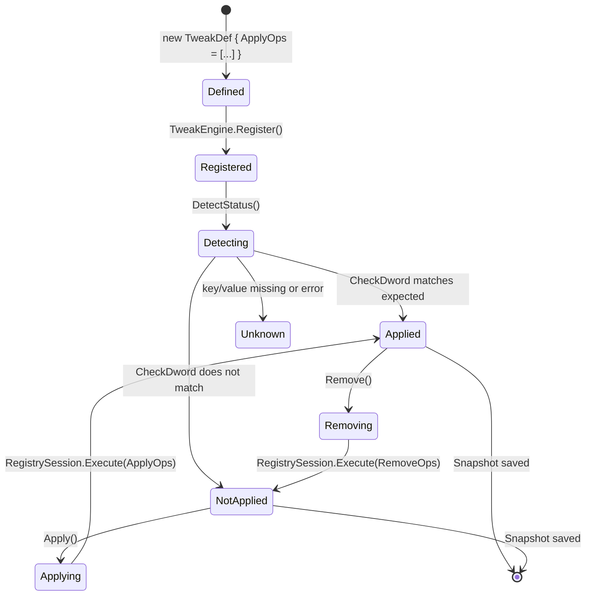

# RegiLattice — Architecture

> Visual overview of the solution structure, data flow, and component relationships.
> All diagrams use [Mermaid](https://mermaid.js.org/) — rendered natively in GitHub Markdown.

---

## Solution Overview

Three projects share `RegiLattice.Core` as the single source of truth for tweak logic:

---

## Core Data Flow — Apply a Tweak

---

## TweakDef Model

---

## TweakEngine Public API

---

## CI/CD Pipeline

---

## Package Manager Dialog Hierarchy (GUI)

---

## 5 Built-in Profiles

---

## Registry Operation Lifecycle

