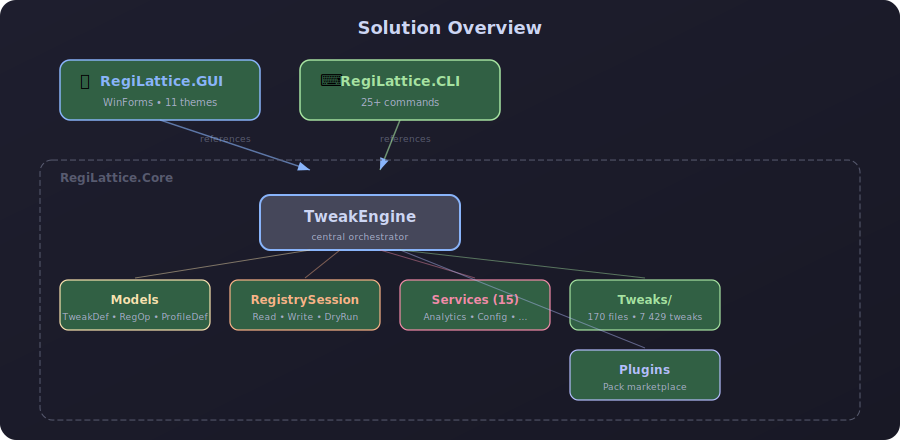
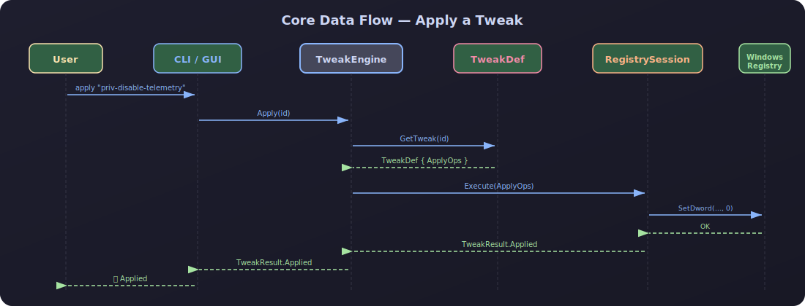
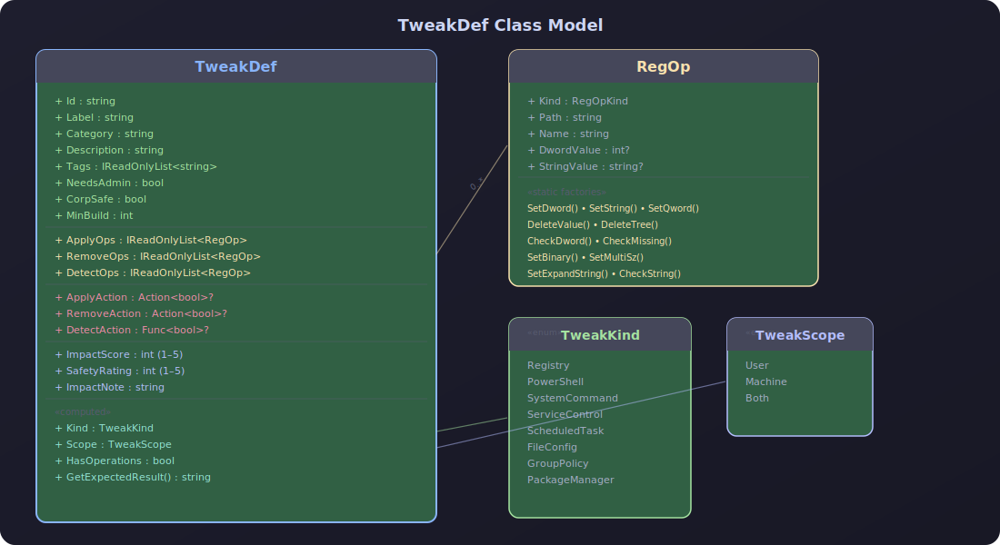
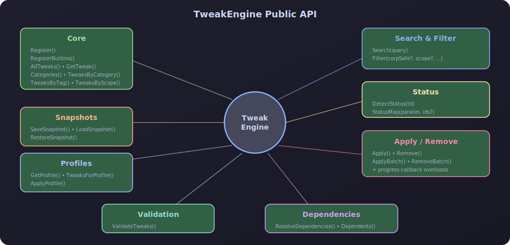
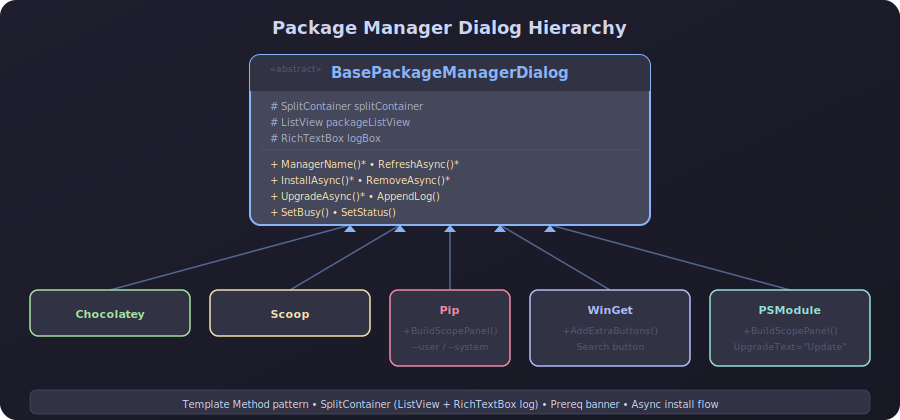
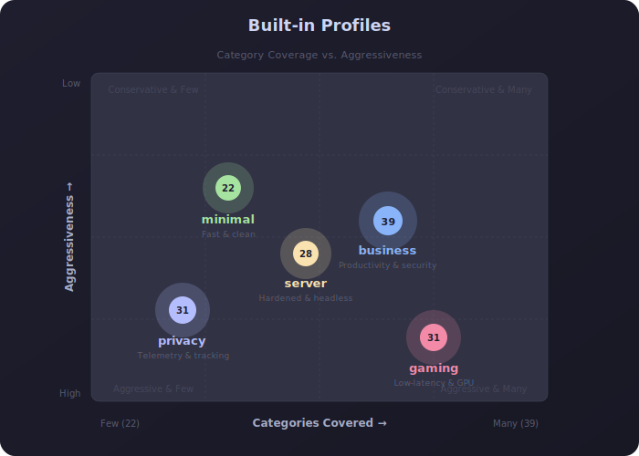
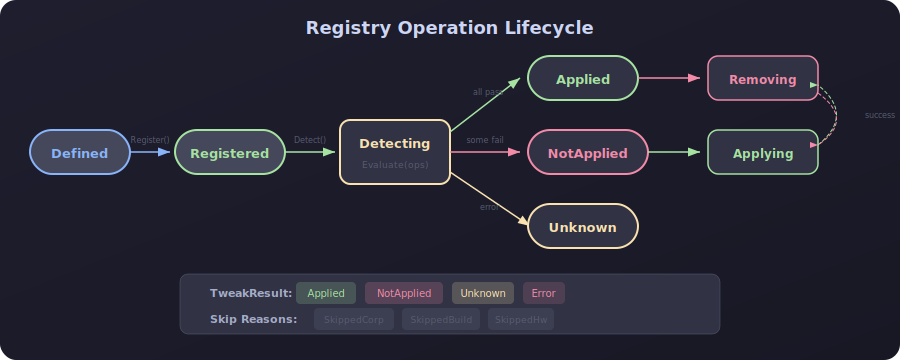

# RegiLattice — Architecture

> Visual overview of the solution structure, data flow, and component relationships.
> All diagrams are hand-crafted SVGs using the Catppuccin Mocha colour palette.

---

## Solution Overview

Three projects share `RegiLattice.Core` as the single source of truth for tweak logic:

  

---

## Core Data Flow — Apply a Tweak

  

---

## TweakDef Model

  

---

## TweakEngine Public API

  

---

## CI/CD Pipeline

  

---

## Package Manager Dialog Hierarchy (GUI)

  

---

## 5 Built-in Profiles

  

---

## Registry Operation Lifecycle

  

