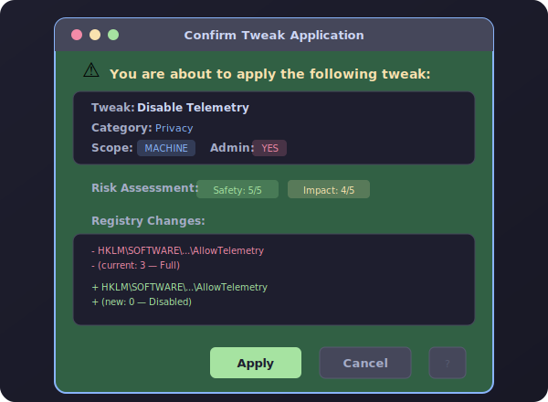

# RegiLattice — Project Roadmap

> Comprehensive improvement plan across every layer of the project.
> Prioritised by impact and ordered by implementation phase.
> Baseline: **v6.24.0** — 7,429 tweaks · 122 categories · 170 files · 3,230 tests · 11 themes

---

## Phase Overview

| Phase | Focus | Timeline | Key Deliverables |
|-------|-------|----------|------------------|
| **Phase 1** | Engine & Model Hardening | Next 2 sprints | Transactional apply, risk flags, before/after diff, cancellation tokens |
| **Phase 2** | UI/UX & Accessibility | Sprints 3–6 | WCAG 2.1 AA, keyboard shortcuts, tweak diff panel, batch ETA |
| **Phase 3** | CLI & Integration | Sprints 7–10 | JSON output piping, batch scripts, conditional apply, interactive wizard |
| **Phase 4** | Test & Quality | Sprints 11–14 | E2E scenarios, mutation coverage 80%+, perf regression baselines |
| **Phase 5** | Tweak Expansion | Sprints 15–20 | +300 new tweaks (security, gaming, accessibility, energy, developer) |
| **Phase 6** | Services & Intelligence | Sprints 21–26 | Audit logging, health score breakdown, scheduling, conflict detection |
| **Phase 7** | Internationalisation & Ecosystem | Sprints 27–30 | 5 new locales, plugin marketplace bootstrap, custom theme API |

---

## Phase 1 — Engine & Model Hardening

### 1.1 Transactional Apply with Auto-Rollback

**Layer**: TweakEngine · RegistrySession
**Priority**: P0 — Critical

`ApplyBatch()` currently applies tweaks sequentially and continues past failures, logging
partial results. When a registry write fails mid-batch (e.g., permissions denied on op 5
of 20), the first 4 ops remain applied with no automated revert.

**Deliverable**: Add a `transactional` parameter to `ApplyBatch()` and `RemoveBatch()`.
When `transactional: true`, the engine captures before-state for every op, and if any op
fails, all preceding ops are reverted in reverse order using the captured before-state.

```csharp
// New API surface
public BatchResult ApplyBatch(
    IReadOnlyList<string> ids,
    bool dryRun = false,
    bool transactional = false,        // ← NEW
    Action<int, int, string>? onProgress = null,
    CancellationToken ct = default);   // ← NEW (see 1.2)

public sealed class BatchResult
{
    public IReadOnlyList<(string Id, TweakResult Result)> Results { get; init; }
    public bool RolledBack { get; init; }           // true if transactional mode reverted
    public IReadOnlyList<string> RollbackErrors { get; init; }  // ops that failed to revert
}
```

**Implementation notes**:
- `RegistrySession.Execute()` gains `captureBeforeState: true` flag that records current
  values before each write. Returns `IReadOnlyList<RegOp> undoOps`.
- On failure, `Execute(undoOps)` is called in reverse to restore prior state.
- DryRun mode: transactional is ignored (no writes to undo).
- `TweakHistory` records both the apply and the rollback as separate events.

---

### 1.2 CancellationToken on All Long-Running APIs

**Layer**: TweakEngine
**Priority**: P0 — Critical

`StatusMap(parallel: true)` spawns parallel detection across 7,429 tweaks but has no
cancellation mechanism. On slow machines or under heavy WMI load, detection can take
30+ seconds with no way for the GUI to cancel. Same applies to `ApplyBatch()`,
`RemoveBatch()`, `Search()`, and `ValidateTweaks()`.

**Deliverable**: Add `CancellationToken ct = default` parameter to:
- `StatusMap(bool parallel, IReadOnlyList<string>? ids = null, CancellationToken ct = default)`
- `ApplyBatch(...)` / `RemoveBatch(...)`
- `Search(string query, CancellationToken ct = default)`
- `ValidateTweaks(CancellationToken ct = default)`
- `Filter(...)` overload with cancellation

**Behaviour**: Token checked between tweaks in sequential mode, and passed to
`Parallel.ForEach` options in parallel mode. On cancellation, returns partial results
collected so far (not an exception — callers inspect `result.IsCancelled`).

---

### 1.3 TweakDef Risk Flags (Bitmask)

**Layer**: Models · TweakDef
**Priority**: P0 — Critical

The current `SafetyRating` (scalar 1–5) collapses multiple risk dimensions into one
number. A tweak that requires a reboot and one that deletes a registry tree both score
"2" but carry fundamentally different risks.

**Deliverable**: Add a `[Flags]` enum and property to `TweakDef`:

```csharp
[Flags]
public enum TweakRisk
{
    None          = 0,
    ModifiesHKLM  = 1 << 0,   // Machine-wide registry change
    ModifiesHKCU  = 1 << 1,   // User-scope registry change
    DeletesKey    = 1 << 2,   // Uses RegOp.DeleteTree or DeleteValue
    RequiresReboot = 1 << 3,  // Change needs reboot to take effect
    AffectsService = 1 << 4,  // Stops/disables a Windows service
    AffectsNetwork = 1 << 5,  // Modifies firewall, proxy, or DNS
    AffectsSecurity = 1 << 6, // Weakens or hardens a security boundary
    PotentialDataLoss = 1 << 7, // Could lose user data (e.g., deletes cache)
}

public sealed class TweakDef
{
    // ...existing properties...
    public TweakRisk RiskFlags { get; init; } = TweakRisk.None;  // ← NEW
}
```

**Auto-detection**: `TweakDef`'s computed `RiskFlags` property auto-infers flags from
`ApplyOps` (e.g., any `DeleteTree` → `DeletesKey`, any HKLM path → `ModifiesHKLM`).
Explicit `RiskFlags` in the initialiser overrides auto-detection.

**GUI impact**: Risk flags shown as coloured badges on the tweak info panel. "⚠ Reboot
Required" (orange), "🗑 Deletes Key" (red), "🔒 Affects Security" (blue).

---

### 1.4 Before/After Registry Diff on Apply

**Layer**: RegistrySession
**Priority**: P1 — High

When a user applies a tweak, they currently see only "Applied" or "Error". There is no
way to confirm what actually changed in the registry.

**Deliverable**: `RegistrySession.ExecuteWithDiff()` that returns a structured diff:

```csharp
public sealed class RegDiff
{
    public string Path { get; init; }
    public string ValueName { get; init; }
    public object? Before { get; init; }   // null if value didn't exist
    public object? After { get; init; }    // null if value was deleted
    public bool Changed => !Equals(Before, After);
}

public (IReadOnlyList<RegDiff> Diffs, TweakResult Result) ExecuteWithDiff(
    IReadOnlyList<RegOp> ops);
```

**Use cases**:
- GUI tweak info panel: "Changed `AllowTelemetry` from `1` → `0`" after apply.
- CLI `--verbose` mode: prints diff table for each tweak.
- Rollback verification: after `RemoveOps`, diff shows value returned to original.
- Audit log: `TweakHistory` stores the diff JSON for compliance.

---

### 1.5 Search Relevance Ranking

**Layer**: TweakEngine
**Priority**: P1 — High

`Search(query)` currently returns all tweaks whose lowercased label, description, tags,
or ID contain the query substring. Results are unranked — an exact ID match appears
alongside a description-only match with no distinction.

**Deliverable**: Return results ordered by relevance score:

| Match Type | Weight |
|------------|--------|
| Exact ID match | 100 |
| ID prefix match (`priv-` for query `priv`) | 80 |
| Exact label match | 70 |
| Label word-start match | 50 |
| Tag exact match | 40 |
| Description substring match | 20 |
| Category name match | 15 |
| Synonym match (existing `_SYNONYMS`) | 10 |

**API change**: `Search()` returns `IReadOnlyList<(TweakDef Tweak, int Score)>` sorted
descending by score. The existing `IReadOnlyList<TweakDef>` overload remains for
backward compatibility (wraps the scored version).

---

### 1.6 Dynamic Custom Profile API

**Layer**: TweakEngine · ProfileDef
**Priority**: P2 — Medium

The 5 built-in profiles (business, gaming, privacy, minimal, server) are static. CLI
supports `--profile-create` for user profiles, but the engine has no runtime API for
programmatic profile composition.

**Deliverable**: New engine methods:

```csharp
public ProfileDef CreateProfile(string name, string description,
    IReadOnlyList<string> applyCategories,
    IReadOnlyList<string>? skipCategories = null);

public void SaveProfile(ProfileDef profile);   // persists to ConfigDir/profiles/
public void DeleteProfile(string name);
public IReadOnlyList<ProfileDef> UserProfiles();  // load from ConfigDir/profiles/
```

**Use cases**: GUI profile wizard can save, Smart Scan can generate recommended profiles,
CLI `--profile-create` delegates to engine instead of custom logic.

---

### 1.7 Tweak Recommendation Engine Integration

**Layer**: TweakEngine · SmartScanService
**Priority**: P2 — Medium

`SmartScanService` exists but is not integrated into TweakEngine's public API. Smart Scan
results are only accessible from the GUI dialog.

**Deliverable**: Expose recommendations via TweakEngine:

```csharp
public IReadOnlyList<TweakRecommendation> RecommendTweaks(
    SmartScanProfile profile,    // hardware + user preferences
    int maxResults = 50);

public sealed class TweakRecommendation
{
    public required TweakDef Tweak { get; init; }
    public required int ConfidencePercent { get; init; }  // 0–100
    public required string Reason { get; init; }          // human-readable
}
```

**Powers**: CLI `--recommend` command, GUI Smart Scan panel with confidence bars, pack
marketplace "suggested for your hardware" badges.

---

## Phase 2 — UI/UX & Accessibility

### 2.1 WCAG 2.1 Level AA Accessibility Compliance

**Layer**: GUI (all Forms, Controls, Dialogs)
**Priority**: P0 — Critical

No accessibility audit has been performed. Screen readers (NVDA, Narrator, JAWS) cannot
navigate the tweak list, category tree, or dashboard. Tab order is undefined in most
dialogs. Colour contrast has not been verified against WCAG 4.5:1 minimum ratio.

**Deliverable — 6 workstreams**:

1. **Tab order**: Set `TabIndex` on every control in every form. Verify with Tab-only
   navigation (no mouse). All interactive controls reachable by Tab/Shift+Tab.

2. **Screen reader labels**: Set `AccessibleName` and `AccessibleDescription` on every
   interactive control. ListView items announce tweak label, status, category, and scope.

3. **Colour contrast**: Audit all 11 themes against WCAG 4.5:1 text contrast and 3:1
   non-text contrast. Document any themes that fail (likely Cyberpunk and Solarized Dark
   on secondary text). Fix or add disclaimer.

4. **Focus indicators**: Ensure visible focus ring on all controls in all themes.
   WinForms default focus rect is invisible on dark themes — override with a high-contrast
   ring.

5. **Keyboard shortcuts**: Implement full shortcut set (see 2.2 below).

6. **High contrast mode**: Detect Windows high-contrast theme and switch to a compatible
   palette. Currently all themes ignore system HC mode.

**Acceptance criteria**: Full keyboard-only navigation of every feature. Narrator reads
all tweak labels, statuses, and category names. No colour-only information (all badges
have text alternatives).

---

### 2.2 Keyboard Shortcut System with Cheatsheet

**Layer**: GUI · MainForm
**Priority**: P1 — High

Only Ctrl+Z/Y (undo/redo) are implemented. Power users expect comprehensive keyboard
navigation without touching the mouse.

**Deliverable**: Global shortcut handler in MainForm + F1 cheatsheet dialog:

| Shortcut | Action | Scope |
|----------|--------|-------|
| `Ctrl+F` | Focus search bar | Global |
| `Ctrl+A` | Select all visible tweaks | Tweak list |
| `Ctrl+Shift+A` | Deselect all | Tweak list |
| `Enter` | Apply selected tweak(s) | Tweak list |
| `Delete` | Remove selected tweak(s) | Tweak list |
| `Ctrl+Z` | Undo last operation | Global (exists) |
| `Ctrl+Y` | Redo last undone operation | Global (exists) |
| `Ctrl+S` | Save snapshot | Global |
| `Ctrl+P` | Open profile selector | Global |
| `Ctrl+T` | Cycle to next theme | Global |
| `Ctrl+,` | Open Preferences | Global |
| `F1` | Show keyboard shortcut cheatsheet | Global |
| `F5` | Refresh status detection | Global |
| `Escape` | Close current dialog / clear search | Context |
| `Space` | Toggle selected tweak checkbox | Tweak list |
| `Ctrl+D` | Toggle favorite on selected tweak | Tweak list |
| `Ctrl+I` | Show tweak info panel | Tweak list |

**F1 dialog**: Two-column layout (shortcut → description), filterable by keyword,
themed to match current palette. Closable via Escape or Enter.

---

### 2.3 Tweak Diff Preview Panel

**Layer**: GUI · MainForm (tweak info panel)
**Priority**: P1 — High

When a user selects a tweak and clicks "Apply", there is no preview of what will
change. For safety-rated 1–2 tweaks, this is especially concerning.

**Deliverable**: Before applying any tweak with `SafetyRating ≤ 3` or `RiskFlags` that
include `DeletesKey | RequiresReboot | AffectsSecurity`, show a confirmation dialog:

<p align="center">
  
</p>

**Implementation**: Uses `RegistrySession.ExecuteWithDiff()` (Phase 1.4) in DryRun mode
to preview the diff without writing. The dialog is themed and shows risk flag badges.

---

### 2.4 Batch Operation Progress with ETA

**Layer**: GUI · MainForm
**Priority**: P1 — High

`ApplyBatch` shows a percentage progress bar but no time estimate. For large batches
(e.g., 100+ tweaks in a profile), users have no idea if it will take 10 seconds or
5 minutes.

**Deliverable**:
1. Add `EstimatedApplyTimeMs` metadata field to `TweakDef` (default: 50ms for Registry
   kind, 500ms for SystemCommand, 2000ms for ServiceControl/PowerShell).
2. GUI progress bar shows: `Applying: 34/100 — ~2 min 15 sec remaining`
3. ETA recalculates dynamically based on actual elapsed time per preceding tweak
   (exponential moving average), not just the static estimate.

**Calculation**:
```
avgPerTweak = exponentialMovingAverage(actualTimesMs, alpha=0.3)
remaining = (total - current) * avgPerTweak
display = formatDuration(remaining)
```

---

### 2.5 Enhanced Context Menu

**Layer**: GUI · MainForm (tweak list)
**Priority**: P2 — Medium

Right-clicking a tweak in the list shows no context menu. All actions require the
toolbar buttons.

**Deliverable**: Right-click context menu on tweak rows:

| Menu Item | Action |
|-----------|--------|
| **Apply** | Apply selected tweak(s) |
| **Remove** | Remove/revert selected tweak(s) |
| **Toggle Favorite** ⭐ | Add/remove from favorites |
| **Copy Tweak ID** | Copy `priv-disable-telemetry` to clipboard |
| **Copy Registry Path** | Copy the primary registry key to clipboard |
| **Open in Registry Editor** | Launch `regedit.exe` navigated to the key |
| **Show Dependencies** | Open DependencyGraph dialog filtered to this tweak |
| **Show Related Tweaks** | Filter list to tweaks with overlapping tags/category |
| **Schedule...** | Open scheduling dialog for this tweak |
| **View History** | Show `TweakHistory` entries for this tweak |

**Separator groups**: Operations (Apply/Remove), Info (Copy/Open/Dependencies), Advanced
(Schedule/History).

---

### 2.6 Custom User Theme Support (JSON)

**Layer**: GUI · Theme.cs
**Priority**: P2 — Medium

The 11 built-in themes are hardcoded `ThemeDef` records. Users cannot create custom
colour palettes without modifying source code.

**Deliverable**: Load user themes from `%LOCALAPPDATA%\RegiLattice\themes\*.json`:

```json
{
  "name": "My Corporate Blue",
  "isDark": true,
  "background": "#1B2838",
  "surface": "#1F3044",
  "primary": "#4A90D9",
  "secondary": "#2ECC71",
  "text": "#E8E8E8",
  "textSecondary": "#A0A0A0",
  "border": "#2A4560",
  "success": "#27AE60",
  "warning": "#F39C12",
  "error": "#E74C3C",
  "accent": "#3498DB"
}
```

- Validated on load (all 12 colour fields required, valid hex format).
- Appears in theme selector dropdown alongside built-in themes.
- Hot-reload: file watcher detects changes and re-reads without restart.
- Invalid JSON shows a warning in the log panel, theme is skipped.

---

### 2.7 High-DPI Vector Icon Rendering

**Layer**: GUI · AppIcons.cs · FluentIcons.cs
**Priority**: P2 — Medium

`AppIcons.cs` generates bitmaps programmatically at fixed pixel sizes. On 150%/200%
DPI displays, these icons appear blurry because WinForms scales them via nearest-
neighbour interpolation.

**Deliverable**:
1. Generate icons at 2× and 3× sizes (32px, 48px, 64px variants).
2. Use `SystemInformation.HighContrast` and `DeviceDpi` to select the appropriate size.
3. Cache generated bitmaps per DPI scale factor in `AppIcons._cache`.
4. For `FluentIcons.cs` SVG path data: render at native DPI using `Graphics.Transform`
   scaling rather than bitmap upscaling.

---

## Phase 3 — CLI & Integration

### 3.1 Global `--json` Output Flag

**Layer**: CLI · Program.cs
**Priority**: P0 — Critical

Every CLI command currently outputs human-readable text (colourised ANSI). There is no
machine-readable output mode. This blocks integration with automation tools, CI/CD
pipelines, and PowerShell scripting.

**Deliverable**: Add `--json` global flag to `CliArgs`. When active, all output is
valid JSON:

```powershell
# Current (human-readable)
RegiLatticeCLI.exe status priv-disable-telemetry
# → ✅ Applied — Disable Telemetry [Privacy]

# With --json
RegiLatticeCLI.exe --json status priv-disable-telemetry
# → {"id":"priv-disable-telemetry","label":"Disable Telemetry","category":"Privacy","status":"Applied","scope":"Machine"}

# List with --json
RegiLatticeCLI.exe --json --list
# → {"tweaks":[{"id":"acc-...","label":"...","category":"...","status":"Unknown"},...]}

# Batch apply with --json
RegiLatticeCLI.exe --json --profile privacy --dry-run
# → {"profile":"privacy","tweakCount":31,"dryRun":true,"results":[...]}
```

**Implementation**: `JsonOutputWriter` class wraps `System.Text.Json.JsonSerializer`.
Each command handler checks `args.JsonOutput` and calls the writer instead of
`ConsoleColorizer`. Exit codes unchanged (0 = success, 1 = error).

---

### 3.2 Batch Script Executor (`--batch-file`)

**Layer**: CLI · Program.cs
**Priority**: P1 — High

IT teams need to deploy tweak configurations across hundreds of machines. Currently
requires chaining multiple CLI invocations in a .ps1 script.

**Deliverable**: New `--batch-file <path>` command that reads a YAML or JSON recipe:

```yaml
# deploy-privacy.rl.yaml
name: "Privacy Hardening"
author: "IT Security Team"
rollbackOnFailure: true
steps:
  - apply: ["priv-disable-telemetry", "priv-disable-activity-history"]
  - apply-profile: "privacy"
  - remove: ["priv-disable-location"]  # exception for this site
  - verify:
      tweaks: ["priv-disable-telemetry"]
      expected: "Applied"
```

**Execution model**: Sequential, with optional `rollbackOnFailure: true` (uses Phase 1.1
transactional mode). Output: JSON report of each step's result. Exit code 0 only if all
steps pass.

---

### 3.3 Conditional Apply Flags

**Layer**: CLI · CliArgs · Program.cs
**Priority**: P1 — High

Scripts need to apply tweaks conditionally: "apply only if not already applied", "apply
only if admin", "apply only if hardware matches".

**Deliverable**: New conditional flags:

| Flag | Behaviour |
|------|-----------|
| `--if-not-applied` | Skip if `DetectStatus` = `Applied` |
| `--if-admin` | Skip if not running elevated |
| `--if-build <N>` | Skip if Windows build < N |
| `--if-hardware <tag>` | Skip if `IsApplicable` returns false for hardware tag |
| `--if-not-corp` | Skip if `CorporateGuard.IsCorporateNetwork()` |

**Example**:
```powershell
RegiLatticeCLI.exe apply priv-disable-telemetry --if-not-applied --dry-run
# → Skipped: Already applied.
```

**Exit codes**: 0 = applied or correctly skipped, 1 = error, 2 = skipped by condition.

---

### 3.4 Interactive Profile Wizard (CLI)

**Layer**: CLI · Program.cs
**Priority**: P2 — Medium

`--menu` exists but presents a flat numbered list. New users don't know which profile to
choose. An interactive wizard that asks preference questions would guide them.

**Deliverable**: `--wizard` command that prompts in sequence:

```
RegiLattice Interactive Setup Wizard
=====================================

1. What is this machine's primary use?
   [1] Office / Business    [2] Gaming    [3] Personal / Home
   [4] Server / Headless    [5] Developer Workstation

2. How important is privacy to you?
   [1] Not important    [2] Moderate    [3] Maximum

3. Is this a managed corporate device?
   [y/N]

Based on your answers, we recommend: "privacy" profile (31 tweaks)
Apply now? [Y/n]
```

**Logic**: Maps answers to a weighted score across the 5 profiles, selects the highest.
Shows a summary of what will change before confirming. Respects `--dry-run` if combined.

---

### 3.5 Watch Mode for Tweak Drift Detection

**Layer**: CLI · Program.cs · new WatchService
**Priority**: P2 — Medium

After applying tweaks, Windows Update, Group Policy refresh, or other software may
silently revert registry changes ("tweak drift"). There is no mechanism to detect this.

**Deliverable**: `--watch <tweaks.json>` command that monitors applied tweaks:

```powershell
RegiLatticeCLI.exe --watch --interval 300  # check every 5 minutes
# → [22:15:30] Watching 42 applied tweaks...
# → [22:20:30] ⚠ DRIFT: priv-disable-telemetry reverted (AllowTelemetry: 0 → 1)
# → [22:20:30] ⚠ DRIFT: perf-disable-animations reverted (value deleted)
```

**Implementation**: Runs `StatusMap()` on the specified interval. Compares results to
"expected" state (last known good). On drift, optionally auto-reapplies (`--auto-fix`)
or logs + exits with code 3.

**Use case**: IT deployment scripts run `--watch --auto-fix --interval 3600` as a
scheduled task to enforce compliance.

---

### 3.6 GPO/Intune Export Enhancements

**Layer**: CLI · PolicyExporter service
**Priority**: P2 — Medium

`--export-gpo` and `--export-intune` exist but output raw key-value pairs. Enterprise
IT needs deployment-ready formats.

**Deliverable**: Enhanced output formats:

| Format | Command | Output |
|--------|---------|--------|
| ADMX/ADML | `--export-gpo --format admx` | Custom ADMX template + ADML language files |
| Intune OMA-URI | `--export-intune --format oma-uri` | JSON for Intune custom configuration profiles |
| Ansible | `--export-ansible` | `win_regedit` tasks in YAML playbook format |
| DSC | `--export-dsc` | PowerShell Desired State Configuration `.ps1` |

---

## Phase 4 — Test & Quality

### 4.1 End-to-End Workflow Test Scenarios

**Layer**: Tests (all 3 projects)
**Priority**: P0 — Critical

Current tests are isolated unit tests per component. No tests verify a complete workflow
from CLI/GUI invocation through engine to registry and back.

**Deliverable**: 10 e2e scenario tests:

| # | Scenario | What It Tests |
|---|----------|---------------|
| 1 | Apply single tweak → detect → verify Applied | Full lifecycle for Registry kind |
| 2 | Apply profile → status map → all Applied | Profile resolution + batch apply |
| 3 | Apply batch → undo all → verify NotApplied | Undo/redo integration |
| 4 | Apply with DryRun → verify no registry writes | DryRun isolation |
| 5 | Apply conflicting tweaks → detect conflict | ConflictDetector integration |
| 6 | Save snapshot → modify system → restore → verify | Snapshot round-trip |
| 7 | CLI `--export-json` → CLI `--import-json` → verify | Export/import pipeline |
| 8 | Apply corporate-blocked tweak → verify SkippedCorp | CorporateGuard integration |
| 9 | Apply tweak with dependency → verify dependency applied first | DependencyResolver |
| 10 | Apply MinBuild-gated tweak on wrong build → SkippedBuild | Build gating |

**All e2e tests use `RegistrySession { DryRun = true }` to avoid real registry writes.**

---

### 4.2 Performance Regression Baselines

**Layer**: Tests · RegiLattice.Benchmarks
**Priority**: P1 — High

`RegiLattice.Benchmarks` project exists but has no CI enforcement. Performance can
silently degrade sprint-over-sprint.

**Deliverable**: Establish baselines and enforce in CI:

| Benchmark | Baseline (7,429 tweaks) | Budget | Action if exceeded |
|-----------|------------------------|--------|-------------------|
| `RegisterBuiltins()` | ~200ms | 500ms | CI warning |
| `Search("telemetry")` | ~60ms | 150ms | CI warning |
| `StatusMap(parallel: true)` DryRun | ~300ms | 750ms | CI warning |
| `ValidateTweaks()` | ~100ms | 300ms | CI warning |
| `Categories()` (cached) | <1ms | 5ms | CI fail |

**CI integration**: Add a `benchmark.yml` workflow that runs monthly on `main`. Results
stored as JSON artifacts. Compare against previous run; flag regressions > 50%.

---

### 4.3 Mutation Testing Coverage Target: 80%+ Branch

**Layer**: Tests · Stryker
**Priority**: P1 — High

Current mutation score is estimated at ~56.8% branch coverage. `Run-MutationTests.ps1`
exists but results aren't tracked.

**Deliverable**:
1. Run full Stryker mutation on `RegiLattice.Core`.
2. Identify top 20 surviving mutants (unkilled mutations).
3. Write targeted tests for each survivor.
4. Target: 80% mutation score on Core, 70% on CLI, 60% on GUI.
5. Track mutation score in CHANGELOG per version.

**Priority survivors** (estimated from coverage gaps):
- `TweakEngine.Filter()` branch conditions (null parameters, empty queries)
- `RegistrySession.ReadValue()` type-switching logic
- `SnapshotManager.Restore()` partial-apply edge cases
- `DependencyResolver.Resolve()` cycle-detection paths

---

### 4.4 GUI Integration Tests

**Layer**: Tests · RegiLattice.GUI.Tests
**Priority**: P2 — Medium

GUI tests cover only Theme, AppIcons, PackageNameValidation, and ExecutableValidation
(357 tests). No tests exercise dialog logic, undo/redo integration, or data binding.

**Deliverable**: Add 100+ integration tests without creating real WinForms windows:

- **Theme tests**: Verify all 11 themes have valid hex colours, sufficient contrast
  ratios (WCAG 4.5:1), and no null fields. (extend existing)
- **Undo/redo stack tests**: Create `TweakOperationStack`, push 50 ops, undo 25, redo
  10, verify state consistency.
- **Profile wizard logic**: Test the scoring algorithm (hardware profile → recommended
  profile) without the dialog.
- **Search integration**: Feed 7,429 tweaks into search logic, verify relevance
  ranking (Phase 1.5).
- **Dashboard data provider**: Test `HealthScoreService` calculations, category
  breakdown aggregation.

---

### 4.5 Locale Translation Coverage Tests

**Layer**: Tests · Core (Locale service)
**Priority**: P2 — Medium

German (DE) locale exists and is tested. No other locales exist. The test verifies all
English keys have German translations.

**Deliverable**:
1. Add locale test infrastructure: `LocaleCompletenessTests` that scans all `T("key")`
   calls in the codebase and verifies every locale file contains those keys.
2. Generate a "missing translations" report per locale.
3. Block CI if English has keys that any enabled locale lacks.
4. Prerequisite for Phase 7 locale expansion.

---

### 4.6 Concurrent Tweak Apply Safety Tests

**Layer**: Tests · Core
**Priority**: P2 — Medium

`ApplyBatch(parallel: true)` and concurrent `StatusMap()` calls could race on registry
access. No tests verify thread-safety.

**Deliverable**:
- Launch 10 concurrent `StatusMap(parallel: true)` calls against the same engine.
  Verify no exceptions and results are consistent.
- Launch 5 concurrent `ApplyBatch()` calls in DryRun mode against overlapping tweak IDs.
  Verify `DryOps` list is consistent (no interleaving).
- Use `ConcurrentBag<Exception>` to catch any unobserved thread exceptions.

---

## Phase 5 — Tweak Expansion (+300 tweaks)

### 5.1 Security Hardening Deep Dive (+80 tweaks)

**Layer**: Tweaks · New modules
**Priority**: P1 — High

Current security coverage: ~80 tweaks. Windows exposes 200+ security-relevant registry
policies that are not yet covered.

**Target areas (8 new modules)**:

| Module | Tweaks | Focus |
|--------|--------|-------|
| `ExploitProtection.cs` | 10 | Per-process DEP, ASLR, CFG, SEHOP enforcement |
| `AttackSurfaceReduction.cs` | 10 | ASR rules (Office macro blocking, credential theft prevention, script obfuscation blocking) |
| `CodeIntegrity.cs` | 10 | WDAC, UMCI, HVCI, driver signing enforcement |
| `CredentialGuard.cs` | 10 | LSA protection, credential isolation, remote credential guard |
| `AppLocker.cs` | 10 | Executable rules, script rules, MSI rules, DLL rules |
| `AuditPolicy.cs` | 10 | Advanced audit policy: logon events, privilege use, object access, policy change |
| `TLS_Hardening.cs` | 10 | Disable TLS 1.0/1.1, enforce TLS 1.3, cipher suite ordering, HSTS preload |
| `DefenderAdvanced.cs` | 10 | Tamper protection, cloud-delivered protection timeouts, PUA blocking, scan scheduling |

**All tweaks**: `CorpSafe = true`, `NeedsAdmin = true`, explicit `ImpactScore` and `SafetyRating`.

---

### 5.2 Gaming & GPU Optimization (+60 tweaks)

**Layer**: Tweaks · New modules
**Priority**: P2 — Medium

Gamers are a primary audience. Current gaming coverage: ~50 tweaks focused on basic
optimizations (disable Game Bar, disable fullscreen optimizations).

**Target areas (6 new modules)**:

| Module | Tweaks | Focus |
|--------|--------|-------|
| `DirectStorage.cs` | 10 | DirectStorage pipeline, GPU decompression, IO priority, NVMe alignment |
| `VariableRefreshRate.cs` | 10 | VRR enforcement, G-Sync/FreeSync policies, frame rate caps, presentation mode |
| `LatencyOptimization.cs` | 10 | Timer resolution (0.5ms), multimedia class scheduling, DPC/ISR latency tuning |
| `GPUPowerStates.cs` | 10 | P-state locking, GPU clock persistence, compute preemption, TDR timeout |
| `NetworkGaming.cs` | 10 | Nagle algorithm disable per-app, TCP timestamps off, RSS/RSC tuning, QoS tagging |
| `AudioGaming.cs` | 10 | Exclusive mode, spatial audio bypass, sample rate locking, buffer size reduction |

---

### 5.3 Accessibility Feature Tweaks (+40 tweaks)

**Layer**: Tweaks · New modules
**Priority**: P2 — Medium

Accessibility category has ~20 tweaks focused on disabling features. Need tweaks that
both enable and configure accessibility features for users who need them.

**Target areas (4 new modules)**:

| Module | Tweaks | Focus |
|--------|--------|-------|
| `VoiceAccess.cs` | 10 | Wake-on-voice, dictation mode, command vocabulary, noise gate, continuous listening |
| `EyeControl.cs` | 10 | Gaze cursor speed, dwell click timing, scroll speed, calibration interval |
| `CaptionsDisplay.cs` | 10 | Live captions, caption styling (font/size/colour/background), language selection |
| `MagnifierAdvanced.cs` | 10 | Magnification level, lens mode, tracking, colour inversion, smooth edges |

---

### 5.4 Energy & Battery Management (+50 tweaks)

**Layer**: Tweaks · New modules
**Priority**: P2 — Medium

Power management category has ~25 tweaks. Laptop users need fine-grained battery
controls beyond basic power plans.

**Target areas (5 new modules)**:

| Module | Tweaks | Focus |
|--------|--------|-------|
| `BatterySaver.cs` | 10 | Trigger threshold, background app behaviour, brightness reduction, notification control |
| `ChargingOptimization.cs` | 10 | Smart charging, charge limit (80%), USB-C power delivery, fast charge toggle |
| `StandbyStates.cs` | 10 | Modern Standby (S0ix) tuning, hibernate after, hybrid sleep, wake timers |
| `CPUPowerStates.cs` | 10 | Core parking, frequency capping, boost mode, thermal limits, EPP balance |
| `DisplayPower.cs` | 10 | Adaptive brightness, auto-dim, HDR auto-enable, refresh rate on battery |

---

### 5.5 Developer Productivity (+70 tweaks)

**Layer**: Tweaks · New modules
**Priority**: P2 — Medium

Developer category has ~60 tweaks but is heavily focused on package management (scoop
tools). Missing: IDE configuration, debugging settings, containerization tuning.

**Target areas (7 new modules)**:

| Module | Tweaks | Focus |
|--------|--------|-------|
| `WSLAdvanced.cs` | 10 | GPU passthrough, systemd, nested virtualisation, network bridging, memory reclaim |
| `DevDriveOptimization.cs` | 10 | ReFS integrity, copy-on-write, anti-virus exclusions, package cache redirection |
| `ContainerRuntime.cs` | 10 | Docker/Podman: daemon settings, layer caching, network mode, resource limits |
| `GitConfiguration.cs` | 10 | Credential manager, GPG signing, delta compression, multi-pack index, fsmonitor |
| `DebuggerSettings.cs` | 10 | WER mini-dump, symbol path, child process debugging, JIT debugger registration |
| `SSHConfiguration.cs` | 10 | OpenSSH server, key management, agent forwarding, connection multiplexing |
| `TerminalAdvanced.cs` | 10 | Windows Terminal: GPU rendering, cursor style, scroll buffer, bell notification |

---

## Phase 6 — Services & Intelligence

### 6.1 Enterprise Audit Logging

**Layer**: Services · TweakHistory
**Priority**: P1 — High

`TweakHistory` records apply/remove/update events with timestamps. For enterprise
compliance (SOC 2, HIPAA, ISO 27001), audit logs must also capture WHO made the change
and on WHICH machine.

**Deliverable**: Extend `TweakHistoryEntry`:

```csharp
public sealed class TweakHistoryEntry
{
    // ...existing fields...
    public string Username { get; init; }      // NEW: Environment.UserName
    public string MachineName { get; init; }   // NEW: Environment.MachineName
    public string SessionId { get; init; }     // NEW: unique per-session GUID
    public IReadOnlyList<RegDiff>? Diffs { get; init; }  // NEW: Phase 1.4 diffs
}
```

**Export format**: `--audit-export <path>` exports CSV/JSON for SIEM ingestion. Includes
all fields. File is signed with HMAC-SHA256 using a per-install secret to detect tampering.

---

### 6.2 Per-Category Health Score Breakdown

**Layer**: Services · HealthScoreService
**Priority**: P1 — High

`HealthScoreService` returns a single scalar score (0–100). Users cannot see which
categories are well-optimised and which need attention.

**Deliverable**: New `CategoryHealthScore` model:

```csharp
public sealed class CategoryHealthScore
{
    public required string Category { get; init; }
    public required int Score { get; init; }        // 0–100
    public required int AppliedCount { get; init; }
    public required int TotalCount { get; init; }
    public required string Recommendation { get; init; }  // "Apply 5 more tweaks"
}

// New engine API
public IReadOnlyList<CategoryHealthScore> CategoryHealthScores();
```

**GUI**: Dashboard shows a horizontal bar chart with per-category scores. Clicking a
bar navigates to that category in the tweak browser. Colours: green (>80), yellow
(50–80), red (<50).

---

### 6.3 Enhanced Conflict Detection

**Layer**: Services · ConflictDetector
**Priority**: P2 — Medium

`ConflictDetector` only checks plugin pack conflicts. Built-in tweaks can also conflict:
tweak A sets `HKLM\X\Y = 0` while tweak B sets `HKLM\X\Y = 1`. Applying both leaves
the last-applied value, which may not be the user's intent.

**Deliverable**: Extend `ConflictDetector` to scan all registered tweaks:

```csharp
public sealed class TweakConflict
{
    public required string TweakIdA { get; init; }
    public required string TweakIdB { get; init; }
    public required string RegistryPath { get; init; }
    public required string ValueName { get; init; }
    public required object ValueA { get; init; }
    public required object ValueB { get; init; }
    public required ConflictSeverity Severity { get; init; }
}

public enum ConflictSeverity { Info, Warning, Critical }
```

**Integration**: `ValidateTweaks()` includes conflict report. GUI shows ⚠ icon on
conflicting tweaks. CLI `--validate --verbose` lists all conflicts.

---

### 6.4 Tweak Scheduling Service Enhancement

**Layer**: Services · ScheduledTweakService
**Priority**: P2 — Medium

`ScheduledTweakService` exists but only supports profile-level scheduling. Users need
per-tweak schedules (e.g., "Apply privacy tweaks at login, remove gaming tweaks at
shutdown").

**Deliverable**:

```csharp
public sealed class TweakSchedule
{
    public required string TweakId { get; init; }
    public required ScheduleTrigger Trigger { get; init; }
    public required ScheduleAction Action { get; init; }
}

public enum ScheduleTrigger
{
    OnLogin, OnLogout, OnStartup, OnShutdown,
    Daily, Weekly, OnNetworkChange, OnPowerChange
}

public enum ScheduleAction { Apply, Remove, Detect }
```

**Implementation**: Creates Windows Task Scheduler entries via `schtasks.exe` that invoke
the CLI with the appropriate `apply`/`remove` command. Managed via GUI Schedule dialog
and CLI `--schedule add/remove/list`.

---

### 6.5 Tweak Versioning & Deprecation

**Layer**: Services · New TweakVersionService
**Priority**: P2 — Medium

When tweaks are renamed, merged, or deprecated across versions, there is no migration
path. Users with saved snapshots or profiles referencing old IDs get silent no-ops.

**Deliverable**: New `TweakMigration` system:

```csharp
public sealed class TweakMigration
{
    public required string OldId { get; init; }
    public required string NewId { get; init; }       // null if deprecated
    public required string Version { get; init; }     // when migration added
    public required string Reason { get; init; }      // "Merged into priv-disable-all-telemetry"
}

// In TweakEngine
public IReadOnlyList<TweakMigration> Migrations { get; }
public string? ResolveMigration(string oldId);  // returns new ID or null
```

**Integration**: `SnapshotManager.Restore()` auto-applies migrations. CLI warns when
using deprecated IDs. `--validate` lists all tweaks with pending migrations.

---

### 6.6 Smart Scan with User Feedback Loop

**Layer**: Services · SmartScanService
**Priority**: P3 — Nice to Have

`SmartScanService` recommends tweaks based on hardware and profile analysis. Recommendations
are static — no learning from user behaviour.

**Deliverable**: Track which Smart Scan recommendations users accept or dismiss:

```csharp
public sealed class SmartScanFeedback
{
    public required string TweakId { get; init; }
    public required bool Accepted { get; init; }
    public required DateTime Timestamp { get; init; }
}
```

Over time, adjust recommendation confidence scores: tweaks that users consistently
dismiss get lower confidence; tweaks that are always accepted get boosted. Stored locally
in `%LOCALAPPDATA%\RegiLattice\smartscan-feedback.json`.

---

## Phase 7 — Internationalisation & Ecosystem

### 7.1 Five New Locales

**Layer**: Services · Locale
**Priority**: P2 — Medium

Only English (EN) and German (DE) are supported. Five additional locales cover ~80% of
the potential international user base.

**Target locales** (in priority order):

| Locale | Language | Est. user share |
|--------|----------|-----------------|
| `fr` | French | 12% |
| `es` | Spanish | 10% |
| `ja` | Japanese | 8% |
| `zh-CN` | Simplified Chinese | 7% |
| `ko` | Korean | 5% |

**Per locale**: Translation of all `Locale.T()` keys (~200 strings), validated by
`LocaleCompletenessTests` (Phase 4.5). Community contributions via dedicated `.resx`
or JSON resource files.

---

### 7.2 Plugin Marketplace Bootstrap

**Layer**: Plugins · PackManager · MarketplaceDialog
**Priority**: P2 — Medium

The Marketplace infrastructure is complete (`PackDef`, `PackLoader`, `PackManager`,
`PackIndex`, `MarketplaceDialog`) but zero public packs exist. The marketplace needs
seed content to attract contributors.

**Deliverable**: Create 5 official example packs:

| Pack Name | Tweaks | Description |
|-----------|--------|-------------|
| `privacy-extreme` | 25 | Maximum privacy: block all telemetry, cloud, and tracking |
| `gaming-fps` | 20 | FPS maximisation: latency, GPU, CPU, network |
| `enterprise-soc2` | 30 | SOC 2 Type II compliance: audit logging, encryption, access controls |
| `developer-full` | 25 | Full dev setup: WSL, Docker, Git, SSH, terminals |
| `accessibility-inclusive` | 15 | Enable and configure all accessibility features |

Each pack includes:
- `pack.json` with all required `PackDef` metadata
- SHA256 integrity hash
- Tests verifying all tweak IDs are unique and don't conflict with builtins

---

### 7.3 Tweak Pack Authoring Guide

**Layer**: Documentation
**Priority**: P2 — Medium

No documentation exists for creating third-party tweak packs. Contributors need a clear
guide with examples, validation steps, and publishing workflow.

**Deliverable**: `docs/PackAuthoring.md` covering:
1. Pack JSON schema with annotated examples
2. How to test a pack locally (`--marketplace install <local-path>`)
3. Validation checklist (unique IDs, no conflicts, integrity hash)
4. Publishing to the marketplace index
5. Pack versioning and update workflow
6. Security requirements (signed manifests, no executable code)

---

### 7.4 PowerShell Module Parity

**Layer**: CLI · PowerShell module
**Priority**: P3 — Nice to Have

`powershell/RegiLattice.psm1` exists as a wrapper module but may lack parity with the
full CLI command set.

**Deliverable**: Ensure all 25+ CLI commands are exposed as PowerShell functions:

```powershell
# Desired ergonomics:
Import-Module RegiLattice
Get-RegiLatticeTweak -Category "Privacy"
Set-RegiLatticeTweak -Id "priv-disable-telemetry" -WhatIf
Get-RegiLatticeProfile -Name "privacy"
Export-RegiLatticeConfig -Path "config.json" -Format Json
```

Each function maps to a CLI command, respects `-WhatIf` (→ `--dry-run`), and returns
strongly-typed `PSCustomObject` output (→ `--json`).

---

### 7.5 GitHub Actions Reusable Workflow for Pack CI

**Layer**: CI/CD
**Priority**: P3 — Nice to Have

Tweak pack authors need a reusable CI workflow to validate their packs against the
latest RegiLattice engine.

**Deliverable**: `.github/workflows/pack-validation.yml` (reusable):

```yaml
# Pack authors add to their repo:
jobs:
  validate:
    uses: RajwanYair/RegiLattice/.github/workflows/pack-validation.yml@main
    with:
      pack-path: "./my-pack/pack.json"
```

The workflow:
1. Checks out RegiLattice
2. Loads the pack via `PackLoader.LoadFromJson()`
3. Registers all builtins + pack tweaks
4. Runs `ValidateTweaks()` — checks unique IDs, broken deps, conflicts
5. Verifies SHA256 hash matches
6. Reports pass/fail as a GitHub Status check

---

## Success Metrics

| Metric | Current (v6.13.0) | Phase 2 Target | Phase 5 Target |
|--------|-------------------|---------------|---------------|
| Tweaks | 7,189 | 7,189 | 7,489+ |
| Categories | 122 | 122 | 152+ |
| Tests | 3,052 | 3,250+ | 3,600+ |
| Branch coverage | 56.8% | 70%+ | 80%+ |
| Mutation score | ~57% | 70%+ | 80%+ |
| Locales | 2 (EN, DE) | 2 | 7 (+ FR, ES, JA, ZH, KO) |
| Themes | 11 | 11 + user JSON | 11 + user JSON |
| CLI output modes | Text | Text + JSON | Text + JSON |
| Marketplace packs | 0 | 0 | 5 official |
| Keyboard shortcuts | 2 | 18+ | 18+ |
| a11y compliance | None | WCAG 2.1 AA partial | WCAG 2.1 AA full |

---

## Risk Register

| ID | Risk | Impact | Mitigation |
|----|------|--------|------------|
| R1 | Transactional rollback fails mid-revert | Registry left in inconsistent state | Capture before-state as backup JSON before transaction; worst case = manual restore |
| R2 | Risk flags auto-detection misclassifies | Users see wrong risk badges | Auto-detection is override-able; explicit `RiskFlags` takes precedence |
| R3 | WCAG contrast audit fails multiple themes | Must fix or remove themes | Fix colours; Cyberpunk and Solarized Dark are highest risk |
| R4 | Batch ETA inaccurate for mixed-kind tweaks | Progress shows wrong estimate | Use exponential moving average instead of static estimate |
| R5 | JSON output breaks existing CLI scripts | Backward compatibility | `--json` is opt-in; default output unchanged |
| R6 | Mutation testing reveals large untested surface | Sprint delays to write tests | Prioritise top-20 survivors; don't pursue 100% |
| R7 | Security hardening tweaks lock out users | System becomes unusable | All security tweaks have `RemoveOps`; reboot to Safe Mode as escape hatch |
| R8 | Locale expansion produces poor translations | Bad UX for non-English users | Machine translation + community review; flag as "beta" locale |
| R9 | Pack marketplace zero adoption | Wasted infrastructure | Seed with 5 official packs; promote on GitHub readme |
| R10 | Watch mode (`--watch`) consumes excessive CPU | Battery drain on laptops | Default interval is 300s; minimum interval enforced at 60s |

---

## Sprint Execution Prompt — 20-Task Consolidation & Release

> **This section is a standing execution plan.** It is meant to be picked up as-is by
> the repo maintainer or an AI agent for a single focused sprint that produces 20
> committed tasks, each with a version-bumped release to GitHub.

### Role

You are the repo maintainer and release engineer. Operate only within this repository.
Follow best practices, but prioritise the requirements below. Do not hand-wave: every
change must be implemented as code/config/docs changes and validated by build/tests.

### Primary Objective

Continue the roadmap by executing the next 20 tasks as one sprint. For each revision bump:

1. Create/track GitHub Issues for non-trivial work.
2. Implement via a Pull Request (or direct commit on `main` per single-dev workflow).
3. Ensure clean build with **0 errors and 0 warnings** (no suppression).
4. Update docs + graphics to match the actual state.
5. Publish a GitHub Release with compiled artifacts attached (do NOT commit binaries
   into the repo unless the repo already does so; prefer Actions artifacts/release assets).
6. Tag the revision and update CHANGELOG.

### Scope Lock (MANDATORY)

- **Windows-only** support.
- Feature scope reduced to **Windows Explorer thumbnail support only**.
- Deliverables must be:
  - **A)** One single Manager EXE (for install/register/unregister/diagnostics).
  - **B)** One thumbnail provider DLL (COM in-proc server) registered for Explorer
    thumbnail generation.
  - **C)** Any additional DLLs only if strictly necessary; minimise footprint.
- Remove all non-related files and implementations, including any Python code/methods/
  scripts and any cross-platform scaffolding.
- Consolidate and deduplicate aggressively: configs, code paths, duplicated utilities,
  docs.
- Goal: **dramatically smaller project footprint**.

### Quality Gates (MANDATORY)

- 0 build errors, 0 build warnings, 0 analyser warnings.
- **No warning suppressions** (no pragma disables, no `/wd`, no "ignore warnings").
  Fix root causes.
- Ensure VS Code extension diagnostics are clean (configure recommended extensions +
  settings; fix issues they flag where reasonable).
- Ensure CI passes (add/adjust GitHub Actions workflows accordingly).
- Run clean builds for all supported configs (at minimum Release x64; include Debug x64
  if the repo supports it).
- Add/adjust tests or minimal verification harness for the thumbnail provider if possible.

### Execution Plan

#### Step 0 — Baseline Verification

- Identify current latest release/tag and current version number in repo.
- Run the build/tests locally (or via CI config) to confirm whether last release is
  truly passing.
- If failures/warnings exist: create Issues and fix first until clean.

#### Step 1 — Sprint Backlog: Implement the Next 20 Tasks

Create a Sprint section in this file (or a dedicated `SPRINT.md` if preferred) listing
these 20 tasks with checkboxes and links to Issues/PRs.

Implement tasks in logical PR-sized chunks. Each PR must include:

- Summary.
- Build/test evidence.
- Checklist confirming 0 warnings and scope lock.

#### The 20 Tasks

| # | Task | Scope |
|---|------|-------|
| 1 | Inventory & delete non-Windows code paths; remove cross-platform build options; update docs accordingly. | Code cleanup |
| 2 | Remove all Python scripts/methods and any pipeline references to Python; ensure replacements exist in PowerShell/MSBuild/CMake as needed. | Code cleanup |
| 3 | Define the minimal architecture: Manager EXE + Thumbnail DLL; document it in `ARCHITECTURE.md`. | Architecture |
| 4 | Implement/confirm COM in-proc thumbnail provider DLL using `IThumbnailProvider` (or existing repo approach) and ensure correct registry entries. | Feature |
| 5 | Ensure Manager EXE supports: install/register, uninstall/unregister, status/diagnostics, and logging path selection. | Feature |
| 6 | Consolidate project structure: `src/` (manager, shell_ext), `include/`, `tests/`, `docs/`; remove unused directories. | Structure |
| 7 | Deduplicate utilities (logging, error handling, COM helpers); enforce a single implementation. | Code quality |
| 8 | Enforce "warnings as errors" across toolchains (MSVC `/W4 /WX` or equivalent; C# `TreatWarningsAsErrors`; clang-cl if used). | Build |
| 9 | Fix all warnings (compiler, static analysis, style), without suppressions. | Build |
| 10 | Add GitHub Actions CI: build + test + package artifacts; ensure clean logs with zero warnings. | CI/CD |
| 11 | Add GitHub Actions Release workflow: on tag, build artifacts and attach Manager EXE + DLL + checksums to GitHub Release. | CI/CD |
| 12 | Add `.vscode`: `settings.json`, `extensions.json`, `tasks.json` to standardise builds, formatting, and diagnostics. | Dev experience |
| 13 | Add `.github`: issue templates (bug/feature), PR template, `CODEOWNERS`, `CONTRIBUTING.md`, `SECURITY.md`. | Governance |
| 14 | Add Dependabot (if dependencies exist) and minimal policy docs. | Governance |
| 15 | Update README to Windows-only + thumbnail scope; include install/uninstall instructions and troubleshooting. | Docs |
| 16 | Update `CHANGELOG.md` for this sprint; adopt SemVer and document version bump rules. | Docs |
| 17 | Update or generate diagrams/graphics with correct current data (prefer Mermaid in Markdown; any images must match current architecture). | Docs |
| 18 | Remove/merge redundant config files (multiple formatters, linters, build configs); keep a single source of truth. | Cleanup |
| 19 | Consolidate documentation: eliminate duplicates, ensure links are correct, and docs match code behaviour. | Docs |
| 20 | Final consolidation pass: reduce footprint (delete unused assets, samples, legacy docs, dead code); verify size reduction and report what changed. | Cleanup |

#### Step 2 — Release Discipline

For each revision bump:

1. Update version in a single canonical location (`Directory.Build.props`).
2. Update CHANGELOG.
3. Open PR (or commit on `main`), pass CI, merge.
4. Create a Git tag (`vX.Y.Z`).
5. Publish a GitHub Release with artifacts (EXE + DLL + checksums).
6. Keep binaries out of git history; publish through Releases unless the repository
   policy requires otherwise.

### Required Outputs (per sprint completion)

When the sprint is complete, the final report must include:

- [ ] Checklist of all 20 tasks with links to Issues/PRs/commits.
- [ ] Confirmation of last release status + evidence (CI links/logs references).
- [ ] Build commands used and configs tested.
- [ ] Where the artifacts are published (Release link) and what files are attached.
- [ ] Footprint reduction summary (what was removed, size reduction estimate if available).
- [ ] Updated diagrams/graphics references and where they live in the repo.

### Metadata Synchronisation Rule (STANDING)

> **On every version bump or count change, ALL files listed below must be updated
> to match the ground-truth counts from the compiled assembly and test suite.**

Ground-truth sources:

| Metric | Source of truth |
|--------|----------------|
| Tweaks | `TweakEngine.RegisterBuiltins()` → `AllTweaks().Count` |
| Categories | `TweakEngine.RegisterBuiltins()` → `Categories().Count` |
| Module files | `Get-ChildItem src/RegiLattice.Core/Tweaks/*.cs | Measure-Object` |
| Tests | `dotnet test` summary per project (Core + CLI + GUI) |
| Themes | `Theme.cs` dictionary entry count |
| Profiles | `ProfileDefinitions.cs` `new ProfileDef` count |
| Version | `Directory.Build.props` `<Version>` |

Files that must be kept in sync:

| # | File | Fields |
|---|------|--------|
| 1 | `Directory.Build.props` | `<Version>`, `<AssemblyVersion>`, `<FileVersion>`, `<InformationalVersion>` |
| 2 | `installer/Package.wxs` | `Version="X.Y.Z"` |
| 3 | `README.md` | Badge, download link, description line, features bullet, diagram counts, test count, module count |
| 4 | `.github/copilot-instructions.md` | Header line, version table row, tweaks/categories/modules/tests row |
| 5 | `.github/instructions/workspace.instructions.md` | Tweaks/module class count in `Tweaks/` directory comment |
| 6 | `docs/CHANGELOG.md` | Prepend new `## [X.Y.Z]` section with Stats line |
| 7 | `docs/assets/stats.svg` | Tweaks count + categories count (space-separated thousands) |
| 8 | `docs/assets/banner.svg` | Tweaks count, categories count, tests count, themes count, profiles count |
| 9 | `docs/assets/architecture.svg` | Tweaks count in TweakDef Modules box, module class count |
| 10 | `docs/assets/how-it-works.svg` | Tweaks count in Browse step |
| 11 | `docs/assets/features.svg` | Per-category tweak count badges |
| 12 | `chocolatey/regilattice.nuspec` | `<version>`, `<summary>`, description counts |
| 13 | `scoop/regilattice.json` | `version`, `url`, description |
| 14 | `winget/RegiLattice.RegiLattice.yaml` | `PackageVersion` |
| 15 | `winget/RegiLattice.RegiLattice.installer.yaml` | `PackageVersion`, `InstallerUrl` |
| 16 | `winget/RegiLattice.RegiLattice.locale.en-US.yaml` | `PackageVersion`, `ShortDescription`, `Description` counts |

**Verification command** (run after every bump):

```powershell
# Ground-truth from compiled assembly
$dll = "$env:TEMP\RegiLattice-build\RegiLattice.Core\bin\Debug\net10.0-windows\RegiLattice.Core.dll"
Add-Type -Path $dll
$e = [RegiLattice.Core.TweakEngine]::new(); $e.RegisterBuiltins()
$tweaks = $e.AllTweaks().Count
$cats   = $e.Categories().Count
$mods   = (Get-ChildItem src/RegiLattice.Core/Tweaks/*.cs).Count
Write-Host "Tweaks: $tweaks | Categories: $cats | Modules: $mods"

# Cross-check against files
$files = @(
    'README.md', '.github/copilot-instructions.md',
    'docs/assets/stats.svg', 'docs/assets/banner.svg'
)
foreach ($f in $files) {
    $hits = Select-String -Path $f -Pattern "$tweaks|$cats" -SimpleMatch
    if ($hits) { Write-Host "  ✅ $f — contains correct counts" }
    else       { Write-Host "  ❌ $f — STALE counts detected" }
}
```
